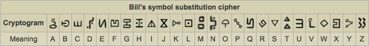
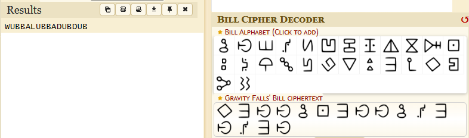

# Solution

---

---

### Challenge title: Adventurous R&M

#### Points: 50

#### Flag:

```
 |  buet{WUBBALUBBADUBDUB}
```

#### Author:

> ```
> C0d3Hunt3r
> ```

### Challenge Description

---

Rick And Morty is full of fun and wacky adventures. One day they got a map under a false bill. Can you help them to hunt the flag??
The flag must contain only capital letters.

Flag format: buet{FLAGHERE}

### Solution of Adventurous R&M

---

#### Skills need to solve this problem

- Google Search/Dorking

#### Process

---

+ Reading the description carefully, I see that a hint was given as **`False Bill`**.
+ So I searched for `False Bill Cipher`, and found the following: 



+ I also went to a decoder for the `FALSS BILL CIPHER DECODER` and got this (https://www.dcode.fr/gravity-falls-bill-cipher)


