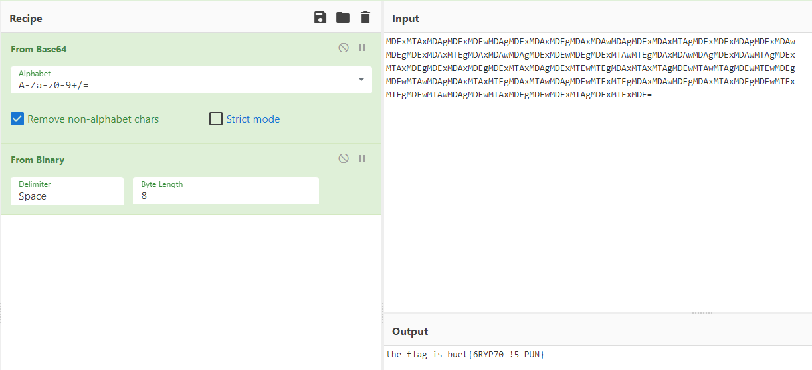

# Solution

---

---

### Challenge title: Asobu Ka Shinu

#### Points: 25

#### Flag:

```
 |  buet{6RYP70_!5_PUN}
```

### Author:

> ```
> C0d3Hunt3r
> ```

### Challenge Description

---

A chienese messenger was caught during the war

He was carrying a piece of paper that read:

MDExMTAxMDAgMDExMDEwMDAgMDExMDAxMDEgMDAxMDAwMDAgMDExMDAxMTAgMDExMDExMDAgMDExMDAw
MDEgMDExMDAxMTEgMDAxMDAwMDAgMDExMDEwMDEgMDExMTAwMTEgMDAxMDAwMDAgMDExMDAwMTAgMDEx
MTAxMDEgMDExMDAxMDEgMDExMTAxMDAgMDExMTEwMTEgMDAxMTAxMTAgMDEwMTAwMTAgMDEwMTEwMDEg
MDEwMTAwMDAgMDAxMTAxMTEgMDAxMTAwMDAgMDEwMTExMTEgMDAxMDAwMDEgMDAxMTAxMDEgMDEwMTEx
MTEgMDEwMTAwMDAgMDEwMTAxMDEgMDEwMDExMTAgMDExMTExMDE=

We are lucky we found him, he was only 64 kilometers from his base

### Solution of Asobu Ka Shinu

---

#### Skills need to solve this problem

+ Base64 Encoding

#### Process

---

+ In the description, `64 kilometers from his base` indicates that the weird message can be a Base64 cipher text.
+ So I went to CyberChef (https://gchq.github.io/CyberChef/) and paste the given cipher text.
+ Then I applied `Base64` decoding and got `binary numbers`.
+ So I again decoded the binaries to `ASCII text`.


