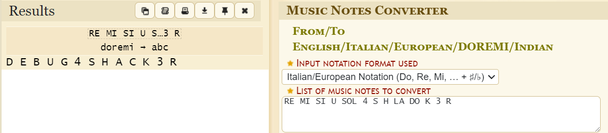

# Solution

---

---

### Challenge title: Bang with Music

#### Points: 50

#### Flag:

```
 |  buet{D_E_B_U_G_4_S_H_A_C_K_3_R}
```

#### Author:

> ```
> C0d3Hunt3r
> ```

### Challenge Description

---

You are discussing with your band members about the upcoming FEST music notes. One of the member 
give you a cheat sheet. You read RE MI SI U SOL 4 S H LA DO K 3 R.

Find out what is in for you. 

Flag format: buet{F_L_A_G}

### Solution of Bang with Music

---

#### Skills need to solve this problem

+ Google Search

#### Process

---

+ In the description, `FEST music notes` indicates that the weird texts can be a **`Music Note cipher`**.
+ So I searched for `Music Note cipher`, and found the following decoder(https://www.dcode.fr/music-notes)

