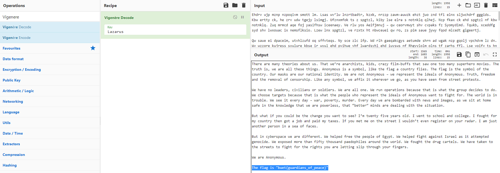

# Solution

---

---

### Challenge title: Kaun Hain ye log

#### Points: 75

#### Flag:

```
 |  buet{guardians_of_peace}
```

#### Author:

> ```
> C0d3Hunt3r
> ```

### Challenge Description

---

One day, you notice that you are getting some weird messages. You backtrack the IP locations and find out that the [messages](./message.txt) were being sent by a hacker group which is operating from North Korea. Can you find out what they were
sending you??

Flag format: buet{your_flag_here}

### Solution of Kaun Hain ye log

---

#### Skills need to solve this problem

+ Google Search

#### Process

---

+ By looking carefully at the given `message.txt` file, it looked to me as **`Vigenere Cipher`**.
+ In the description, a ``Hacker Group from North Korea`` was mentioned.
+ So I googled for this and found the group to be **`Lazarus Group`**.
+ Then I went to CyberChef (https://gchq.github.io/CyberChef/) and paste the given cipher text.
+ I applied `Vigenere Decoder` decoding and used `Lazarus` as the key and got the flag.

