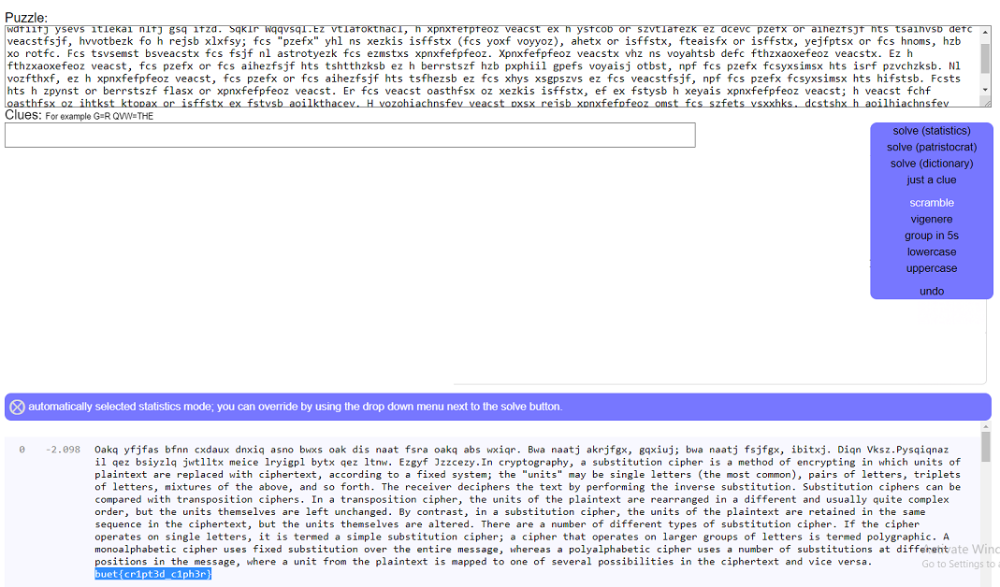

# Solution

---

### Challenge title: Substitution

#### Points: 50

#### Flag:

```
 |  buet{cr1pt3d_c1ph3r}
```

#### Author:

> ```
> C0d3Hunt3r
> ```

### Challenge Description

---

A [message](./substitution.txt) has come in but it seems to be all scrambled. Can you crack this substitution cipher?

Flag format: buet{fl4g_h3r3}

### Solution of Substitution

---

#### Skills need to solve this problem

+ Google Search

#### Process

---

+ As the problem name says, it is a **`Substitution Cipher`** problem.
+ So I searched for online tools that can solve Substitution Cipher and found this site (https://quipqiup.com/)
+ I copy & paste the given message there and start the solve using scrambling.

