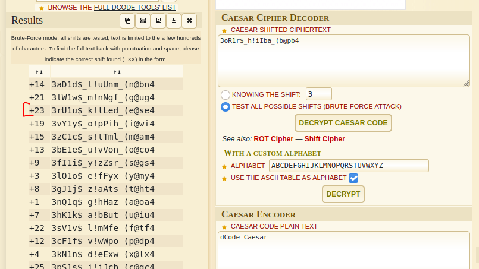

# Solution

---

### Challenge title: Bad Friend

#### Points: 50

#### Flag:

```
 |  buet{3rU1u$_k!lLed_(e@se4}
```

#### Author:

> ```
> C0d3Hunt3r
> ```

### Challenge Description

---

Brutus loves Caesar but doesn't want him to become king. Jealous conspirators convince Caesar's friend Brutus to join their assassination plot against Caesar Brutus has planned something to kill Ceaser. Can you find his mission code?	

### Solution of Bad Friend

---

#### Skills need to solve this problem

+ Caesar Cipher
+ Linux Basic Commands

#### Process

---

+ Running **`strings`** on the [image](./caesar.jpg) provided me with the following:

    ``` 
    strings caesar.jpg

    ...
    H'cC
    "G      $
    m$F>
    6>'k
    uBUlYf
    J-YA
    /$00a
    [?\L
            mm[q
    buet{3oR1r$_h!iIba_(b@pb4}
    ```

+ The flag seemed to be encrypted. By reading the problem description carefully, I surmised that the flag used a **`Caesar cipher`**.

+ Running the cipher through a [brute force decoder](https://www.dcode.fr/caesar-cipher) I got the follow:
