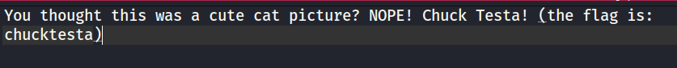

# Solution

---

### Challenge title: Cutu Cat

#### Points: 50

#### Flag:

```
 |  buet{chucktesta}
```

#### Author:

> ```
> C0d3Hunt3r
> ```

### Challenge Description

---

This is the picture of Rufus, the brother from another mother of the mighty catto of ECE

Despite being cute, Rufus hides a dark secret, can you help me to find it out?

Flag Format: buet{flag}

### Solution of Cutu Cat

---

#### Skills need to solve this problem

+ Steganography
+ Stegoveritas

#### Process

---

+ By reading the problem description carefully, I assumed that there was something hidden in the given [file](./rufus.jpg)

+ As the given file was a `.jpg` file, so I used **`Stegoveritas`** to extract the hidden files
  
  ```
  stegoveritas rufus.jpg
  ```
  
    You could also use **`Steghide`** to extract the hidden files.
  
  ```
  steghide extract -sf rufus.jpg
  ```

+ In the extracted folder, I got a `.bin` file which contained the flag.
  
