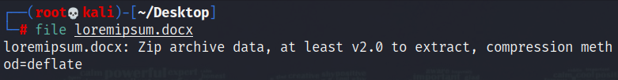

# Solution

---

### Challenge title: DocScan

#### Points: 50

#### Flag:

```
 |  buet{openxml}
```

#### Author:

> ```
> C0d3Hunt3r
> ```

### Challenge Description

---

Hiding something in word document...
Dig deeper and get it!!

Flag format: buet{flag}

### Solution of DocScan

---

#### Skills need to solve this problem

+ Steganography
+ Basic linux commands

#### Process

---

+ At first I checked the given [file](./loremipsum.docx) type and found it to be a zip file
  
+ So, I changed the file extension from `.docx` to `.zip` and unzip it running the following command:
  
  ```
  unzip loremipsum.zip
  ```
+ After unzipping, we again got a file named `loremipsum.docx`, but it's file type was `zip`
+ So I followed step 2 again and got a file named `flag.txt`, which contained our desired flag
  
  ```
  flag = openxml
  ```
