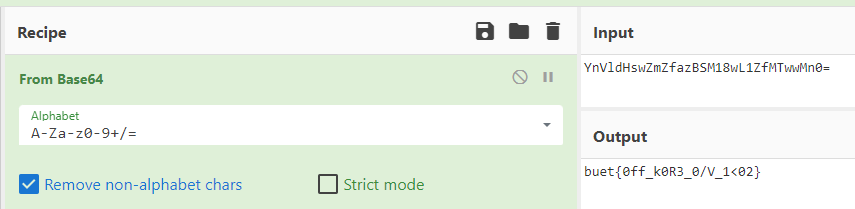

# Solution

---

### Challenge title: Just Engineering Things

#### Points: 25

#### Flag:

```
 |  buet{0ff_k0R3_0/V_1<02}
```

#### Author:

> ```
> C0d3Hunt3r
> ```

### Challenge Description

---

Code Chole Na?? Grow up dude.. You know what to do!!	

### Solution of Just Engineering Things

---

#### Skills need to solve this problem

+ Base64 encoding
+ Linux Basic Commands

#### Process

---

+ Running **`strings`** on the [image](./tay.jpg) provided me with the following:

    ``` 
    strings tay.jpg

    ...
    9tXs
    aA98
    BWsY
    7*cc
    /pPZc
    _dk[
    8s2,
    u))g
    qrcz
    YnVldHswZmZfazBSM18wL1ZfMTwwMn0=
    ```

+ The last line `YnVldHswZmZfazBSM18wL1ZfMTwwMn0=` seemed to be the flag, which may be encrypted in `Base64`.

+ So, I used [CyberChef](https://gchq.github.io/CyberChef) to decode it & found the following:
