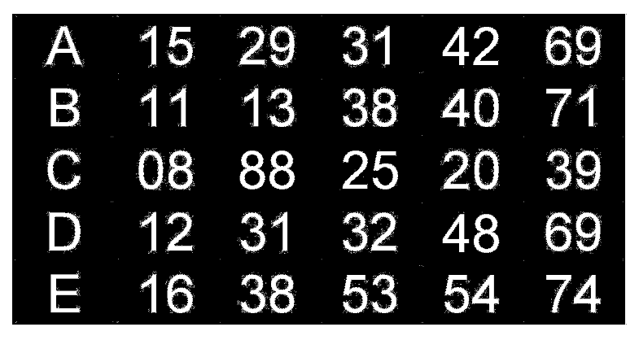

# Solution

---

### Challenge title: Lottery Ticket

#### Points: 75

#### Flag:

```
 |  buet{203}
```

#### Author:

> ```
> C0d3Hunt3r
> ```

### Challenge Description

---

Can you tell me which the new numbers are that are photoshopped?

Add them all up, the resulting number is the flag.

Format: buet{result}	

### Solution of Lottery Ticket

---

#### Skills need to solve this problem

+ Steganography

#### Process

---

+ For checking changed `bitplanes` of an image file, we can use **`stegsolve`**
+ So, I started analysing the given [image](./lotteryticket.jpg) file using `stegsolve`
+ When I applied `Green Plane 6`, I got the following:

+ So, I saw that the bitplanes of `42,88,25,48` were changed.
+ Thus sum of those is **`203`**, which is the flag