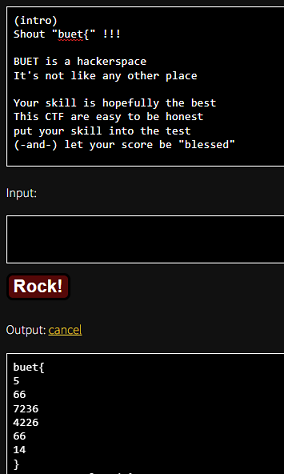

# Solution

---

### Challenge title: A Song

#### Points: 75

#### Flag:

```
 |  buet{566723642266614}
```

#### Author:

> ```
> C0d3Hunt3r
> ```

### Challenge Description

---

Sing it loud!! https://www.youtube.com/watch?v=CqhbBzvKUt0

### Solution of A Song

---

#### Skills need to solve this problem

+ Google Search
+ Rockstar Language

#### Process

---

+ From the link given in the problem description, I got the hint that the given [file](./a_song.txt) could be something related to `Rockstar`.
+ So, I searched google for **`Rockstar Decoder`** and got [this site](https://codewithrockstar.com/online).
+ I copy & paste the given file's text, decode it and got the flag.

