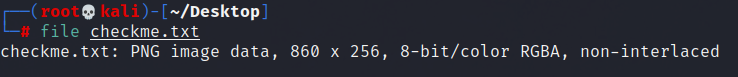

# Solution

---

### Challenge title: Corrupt

#### Points: 25

#### Flag:

```
 |  buet{REDACTED}
```

#### Author:

> ```
> C0d3Hunt3r
> ```

### Challenge Description

---

Hey, can you fix me?? I think I am not in my form!!
Flag format: buet{FLAG}

### Solution of Corrupt

---

#### Skills need to solve this problem

+ File Extension

#### Process

---

+ By reading the problem description, I got the hint that there might be an extension error in the given file ["checkme.txt"](./checkme.txt)
+ So I ran **`file`** command to check the actual file type and found it to be a `PNG` file


+ So I changed the extension from `.txt` to `.png` and then opening the file I got this:


+ So the flag was:
```
    buet{REDACTED}
```