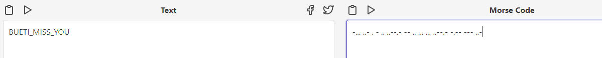

# Solution

---

### Challenge title: Granny Granny!

#### Points: 150

#### Flag:

```
 |  buet{i_miss_you}
```

#### Author:

> ```
> C0d3Hunt3r
> ```

### Challenge Description

---

One day I was going through my mailbox and suddenly saw that my grandmother sent me an email. When I open it, I got a hidden message in it. But I can't figure it out! Can you help me? The flag will contain only small letters.

Flag Format: buet{put_your_flag_here}

### Solution of Granny Granny!

---

#### Skills need to solve this problem

+ Morse Code

#### Process

---

+ By having a closer look at the subject of the mail, I saw a large amount of tbh: and ngl:'s - which is not too unusual in a mail from grandma.
+ But the curly braces in between caught my attention as it resembled the flag format.
+ My initial guess was it being binary with the tbh: as a 0 or 1 and the ngl: as a 1 or 0, respectively.
+ But that lead to nothing.
+ So, I figured it was morse code instead. Knowing that the morse code before the opening of the curly braces had to be "buet", I could confirm my hypothesis and find out the correct mapping.
```
    "tbh: " => "-"
    "ngl: " => "."
```
+ So the resulting morse code was: 
```
    -... ..- . -{.. ..--.- -- .. ... ... ..--.- -.-- --- ..-}
```
+ Then, I replace the `{` & `}` with space and got the flag.



<big>**Quick Note: I noticed that there were in fact double spaces in the header seperating the morse letters. Moreover, while taking the subject section in one line, I had to keep the spacing perfect(there must be a space between "tbh:" & "ngl:")**</big>