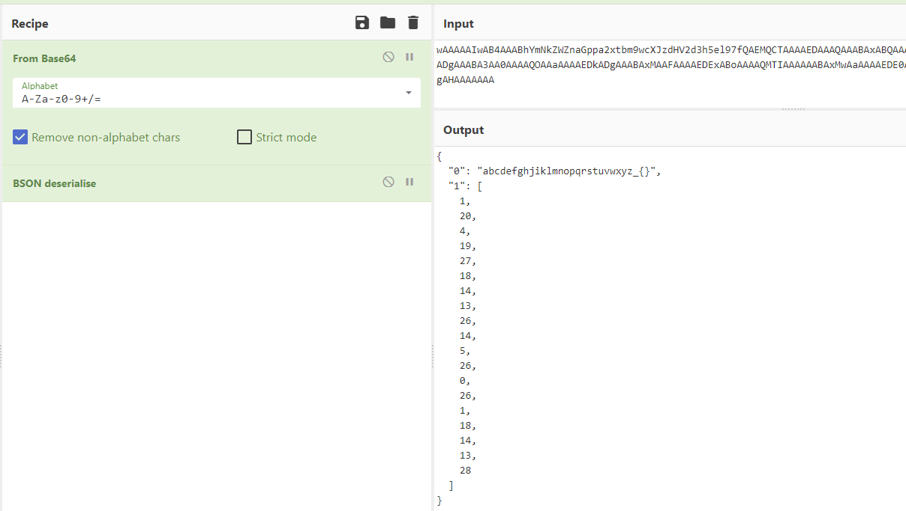
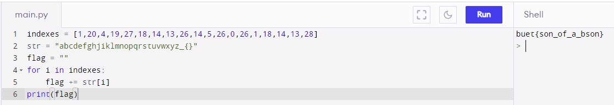

# Solution

---

### Challenge title: JSON or Not!

#### Points: 150

#### Flag:

```
 |  buet{son_of_a_bson}
```

#### Author:

> ```
> C0d3Hunt3r
> ```

### Challenge Description

---

My friend send me a weird [file](./file.txt). Can you decode it for me?

Flag Format: buet{put_your_flag_here}

### Solution of JSON or Not!

---

#### Skills need to solve this problem

+ Base64
+ BSON

#### Process

---

+ The text inside the file looks like to be `Base64` encoding text.
+ So, I decode it from Base64 using [CyberChef](https://gchq.github.io/CyberChef) & get this:
```
À....0.....abcdefghjiklmnopqrstuvwxyz_{}..1......0......1......2......3......4......5......6......7.
....8......9......10......11......12......13......14......15......16......17.
....18.......
```
+ Now, as the problem name says, I assume the above output to be JSON or something related to this and find it to be **`BSON`**.
+ So, I use `BSON deserialize` and get the following:



+ So, the result is a string, and a list of integers. Then I use the list of integers as indexes into the string to get the flag. For this I write a [python code](./script.py), run this and get the flag.

