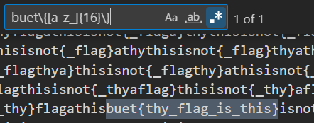

# Solution

---

### Challenge title: Mr.Regex

#### Points: 75

#### Flag:

```
 |  buet{thy_flag_is_this}
```

#### Author:

> ```
> C0d3Hunt3r
> ```

### Challenge Description

---

Can you find me the flag in the attached [file](./file.txt). The flag will be in the format of "buet{you_got_a_flag}", except the quotes. The text between the curly braces can consist of lowercase characters and underscores and will be a maximum length of 16. You'll get to know it when you see it.

### Solution of Mr.Regex

---

#### Skills need to solve this problem

+ Regular Expressions

#### Process

---

+ The challenge says that the flag will be a maximum length of 16. If we use a **regex** that allows strings up to 16, we will have a lot of results. If we use a regex with an exact length of 16, the flag is obvious.
+ As the flag format says, the answer will start with `buet{` and with `}` and the main flag will contain only `a-z & _`. So I use the following regex:
```
    buet\{[a-z_]{16}\}
```

