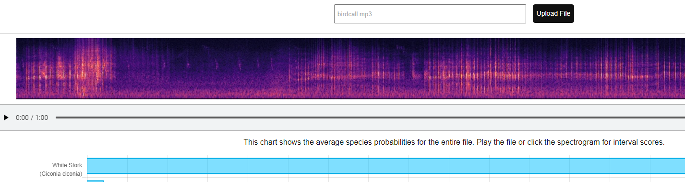

# Solution

---

### Challenge title: Bird of Culture

#### Points: 75

#### Flag:

```
 |  buet{ciconia_ciconia}
```

#### Author:

> ```
> C0d3Hunt3r
> ```

### Challenge Description

---

Imagine, on a weekday, you were going to sit on a EEE CT chanting the famous slogan "EEE ***", nvm. Suddenly you heard a birdcall which lifted up your mood and your CT came out to be too good(yeah dude..it only happens in imagination.. chill). You have much fascination with LATIN words. Can you find the LATIN name of that bird's species?

Replace (if any) spaces with underscores ('_') and flag will contain only small letters.

Flag format: buet{flag_here}

### Solution of Bird of Culture

---

#### Skills need to solve this problem

+ Google Search

#### Process

---

+ The problem description says that we have to find the bird's species and we are given an [audio file](./birdcall.mp3)
+ So I googled **`bird species finder by audio`** and got this [site](https://birdnet.cornell.edu/api/)
+ Then, I uploaded the [given mp3](./birdcall.mp3) file there
+ The cool website did some magic stuff to determine what bird it was and found it to be `White Stork`


+ In latin, that's **`Ciconia ciconia`**

