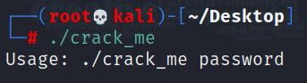
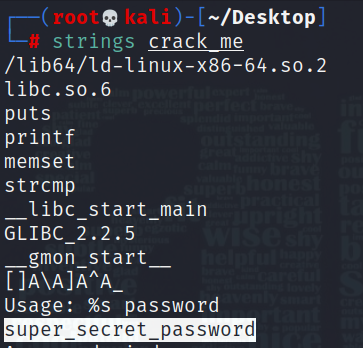
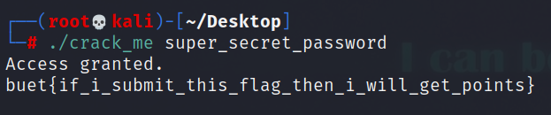

# Solution

---

### Challenge title: Not Found

#### Points: 50

#### Flag:

```
 |  buet{if_i_submit_this_flag_then_i_will_get_points}
```

#### Author:

> ```
> C0d3Hunt3r
> ```

### Challenge Description

---

Do you even Linux? I wish there were a good tool to list strings used by a program...

### Solution of Not Found

---

#### Skills need to solve this problem

+ ELF executable file
+ Basic Linux Commands

#### Process

---

+ At first, I tried to run the given [file](./crack_me) and it returned me with `permission denied` error
+ So, for having the permission to make it runnable, I ran the following command:
  ```
  chmod +x crack_me
  ```
+ Now, when I tried to run it again, it asked me for a password


+ By reading the description carefully, I assumed that `strings` command could help me to get the password

+ Finally, I got the password to be **`super_secret_password`**
