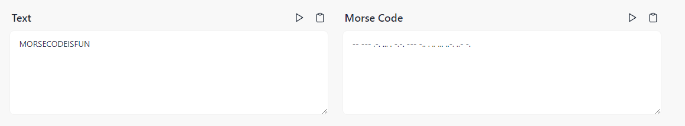

# Solution

---

---

### Challenge title: EZ SymbolzZZ

#### Points: 50

#### Flag:

```
 |  buetsec{MORSECODEISFUN}
```

#### Author:

> ```
> C0d3Hunt3r
> ```

### Challenge Description

---

Is this a new language? I think you have encountered it before, don't you?

```
!! !!! &!& &&& & !&!& !!! !&& & && &&& &&!& &&! !&
```

Flag format: buetsec{FLAGHERE}

### Solution of EZ SymbolzZZ

---

#### Skills need to solve this problem

- Morse Code

#### Process

---

+ As you can see, the given cipher text has only two types of symbols. So, there is two big chances:
  + It can be morse code
  + Or, it can be a binary string

+ So, by replacing `!` with `-` and `&` with `.`. Finally you got a morse code:
  ```
  -- --- .-. ... . -.-. --- -.. . .. ... ..-. ..- -.
  ```

+ So, I searched for `Morse code decoder` and found this (https://morsedecoder.com/)



+ Adjusting the text to the flag format, we got our flag which is:

>```
> buetsec{MORSECODEISFUN}
>```