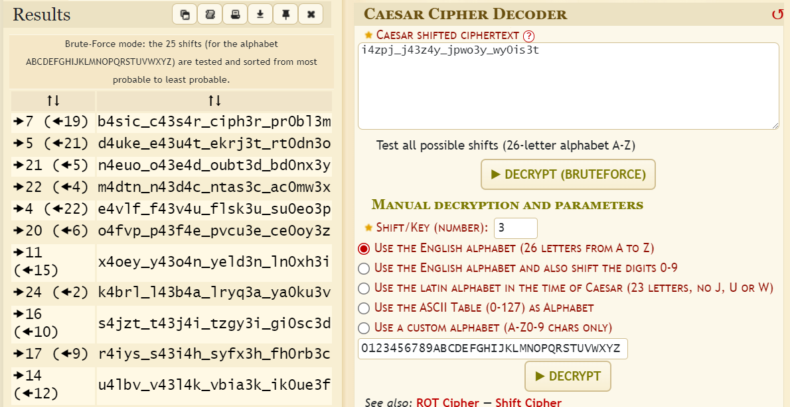

# Solution

---

---

### Challenge title: Roman Dudes

#### Points: 25

#### Flag:

```
 |  buetsec{b4sic_c43s4r_ciph3r_pr0bl3m}
```

#### Author:

> ```
> C0d3Hunt3r
> ```

### Challenge Description

---

You know what you have to do: **`i4zpj_j43z4y_jpwo3y_wy0is3t`**

Flag format: buetsec{fl4g_h3r3}

### Solution of Roman Dudes

---

#### Skills need to solve this problem

- Caesar Cipher

#### Process

---

+ Judging from the hint given in the `Problem Name`, the cipher used is the **Ceasar Cipher**, which produce the ciphertext by shifting the letters in the cleartext a set number of times.

+ I went to a decoder for the **`Caesar Cipher Decoder`** and got this (https://www.dcode.fr/caesar-cipher)



+ Adjusting the text to the flag format, we got our flag which is:

>```
> buetsec{b4sic_c43s4r_ciph3r_pr0bl3m}
>```