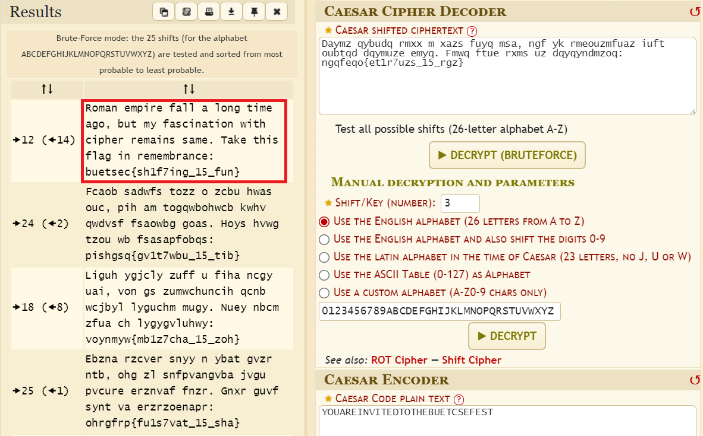

# Solution

---

---

### Challenge title: Shift Me

#### Points: 25

#### Flag:

```
 |  buetsec{sh1f7ing_15_fun}
```

#### Author:

> ```
> C0d3Hunt3r
> ```

### Challenge Description

---

Kevin got his letters confused. Help him out to decode it!!

```
Daymz qybudq rmxx m xazs fuyq msa, ngf yk rmeouzmfuaz iuft oubtqd dqymuze emyq. Fmwq ftue rxms uz dqyqyndmzoq: ngqfeqo{et1r7uzs_15_rgz}
```

### Solution of Shift Me

---

#### Skills need to solve this problem

- Caesar Cipher

#### Process

---

+ Reading the problem name , I see that a hint was given as `Shift Me`, which means it was **`Caesar Cipher`**
  

+ I went to a decoder for the **`Caesar Cipher Decoder`** and got this (https://www.dcode.fr/caesar-cipher)



+ So, the flag is:

>```
> buetsec{sh1f7ing_15_fun}
>```