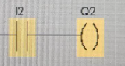
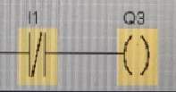
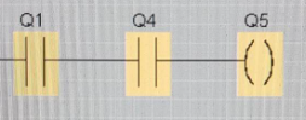
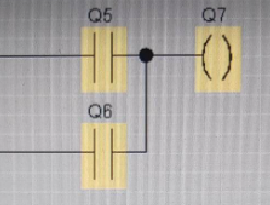

# Solution

---

---

### Challenge title: Ladder

#### Points: 200

#### Flag:

```
 |  buetsec{13C15F}
```

#### Author:

> ```
> Inspired from Leetcon 2022
> ```

### Challenge Description

---

If, 
```
    I1 = 1101011011001001110110
    I2 = 1001100111001100101001
```

then, find the hex value of Q7.

Let's say if Q7 = 00000000010111, then flag will be: buetsec{17}

[Ladder](./Photos/Ladder.PNG)

Flag format: buetsec{hex_number}

### Solution of Ladder

---

#### Skills need to solve this problem

- Logical Binary Operations

#### Process

---

Let's first get introduced with the different portion of the given [image](./Photos/Ladder.PNG)

+ The below diagram represents that current value of I2 is to be stored in Q2


+ The below diagram represents that current value of I1 is `1's complement` first and then to be stored in Q3


+ The below diagram represents that current value of Q1 and Q4 is `Logical AND` first and then stored in Q5


+ The below diagram represents that current value of Q5 and Q6 is `Logical OR` first and then stored in Q7


+ Now, analysing the given diagram from bottom to top, we get,
    - Q3 = 0010100100110110001001
    - Q2 = 1001100111001100101001
    - Q1 = 1101011011001001110110
    - Q4 = 0110011000110011010110
    - Q5 = 0100011000000001010110
    - Q6 = 0000100100000100001001
    - Q7 = 0100111100000101011111

+ Now, hex value of `Q7 = 0100111100000101011111` is `13C15F`

>```
> buetsec{13C15F}
>```