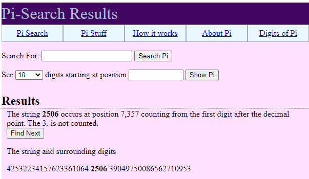

# Solution

---

---

### Challenge title: Intra BUET CTF day

#### Points: 100

#### Flag:

```
 |  buetsec{7358}
```

#### Author:

> ```
> C0d3Hunt3r
> ```

### Challenge Description

---

Today is June 25, 2023 and Intra BUET CTF V2.0 is going on. Can you find the position of the first occurence of the numerical representation of day & month of this date i.g.`2506` in the value of pi ??
The flag will be the position of the first digit of 2506 within pi. Consider 3 as the first digit and don't  consider . as a position.

Flag Format: buetsec{position}

### Solution of Intra BUET CTF day

---

#### Process

---

+ I found a [site](https://www.angio.net/pi/digits.html) that does our work without any effort.



+ So, `2506` occurs at position **7357**, where `3` is not counted while finding the position. Thus, considering `3` as the first digit and not considering `.` as a position, we got position to be **`7358`**

Adjusting the text to the flag format, we got our final flag which is:

>```
> buetsec{7358}
>```