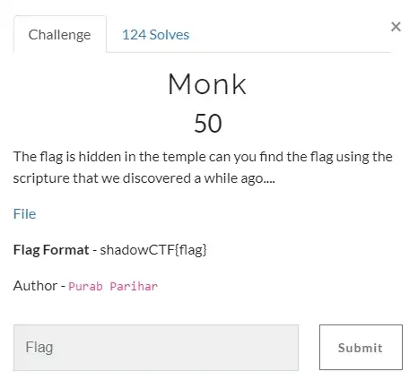
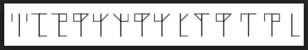
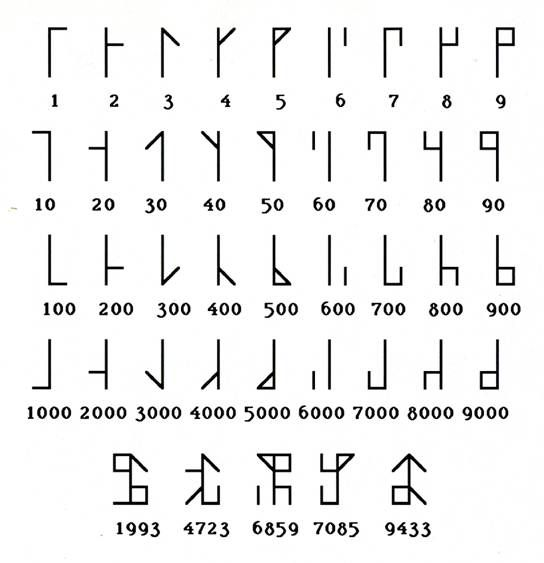
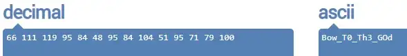

# ShadowCTF Valhalla Write Up

## Details:
Points: 50

Category: Cryptography

## Write up:

The challenge presented me with the following:



So let's see what is inside "File"



Now, in the description, the problem name `'monk'` looks like a keyword. So I searched for **`MONK CIPHER`**  and found it to be `Cistercian Monk Numerals` cipher and also got the following for decoding it:



The way these runes work is that by adding them together we get different numbers. You can see some examples at the bottom of the above image. After decoding the given file using above image, we get decimal numbers like this.

```
66 111 119 95 84 48 95 84 104 51 95 71 79 100
```
These values are all in the range for ASCII value. So we need to convert these numbers to ASCII characters to get the flag. We can do it using any online tool (https://onlinestringtools.com/convert-ascii-to-string).




I also went to a decoder for the `"MONK CIPHER DECODER"` and got this (https://www.dcode.fr/cistercian-numbers) or (https://asecuritysite.com/challenges/monk)


``` 
  | Flag: shadowCTF{Bow_T0_Th3_GOd}
```