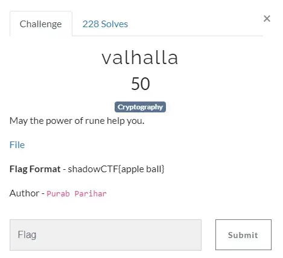
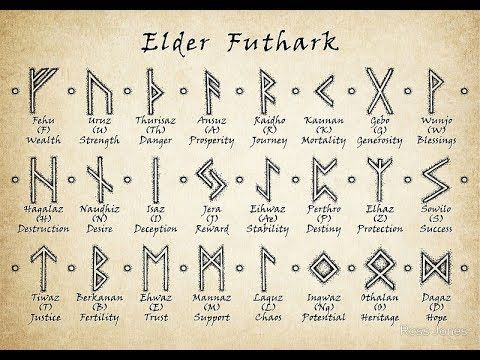
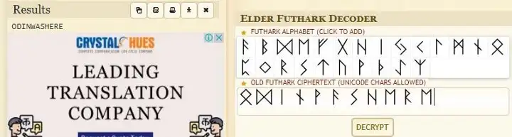

# ShadowCTF Valhalla Write Up

## Details:
Points: 50

Category: Cryptography

## Write up:

The challenge presented me with the following:



So let's see what is inside "File"


So we have some wired text in front of us. Now, as `"rune"` is mentioned in the description of the challenge let's google search it. I googled "runes" and found the following:



Using the above image to decode I was able to find the flag:

```
odin was here
```

I also found this link which is useful to decode it. (https://www.dcode.fr/elder-futhark)



``` 
  | Flag: ShadowCTF{odin_was_here}
```