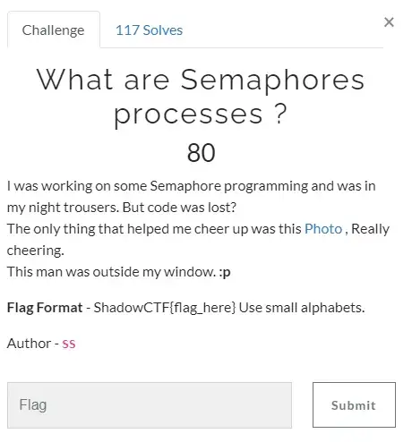

# ShadowCTF Valhalla Write Up

## Details:
Points: 80

Category: Cryptography

## Write up:

The challenge presented me with the following:



So let's see what is inside "File"


Now, we see a hint `"trousers"` is mentioned in the description of the challenge. So I googled **`TROUSER CIPHER`** and found this link which is useful to decode it: https://www.dcode.fr/semaphore-trousers-cipher


``` 
  | Flag: ShadowCTF{thank_you_hacker}
```